문서화
#############

아마 세계 최고의 API를 제공하고 있지만, 문서화되어 있지 않은 API는 어쩌면
회사에서 돈을 받으니 억지로 쓰거나, 고통을 즐기는 사람들이나 사용할 것이다.
문서화의 목적은 개발자에게 관심을 가지도록 하는 것이다. 그 중에는  취미개발자, 
초보자, 프리랜서, 현업 개발자, 학생 등이 모두 포함되며, 이들 모두에게 API를
잘 설명하는 것이 중요하다.

어떤 개발자들은 API 레퍼런스가 더 친숙할 수 있고, 다른 사람은 예제 코드, 또는
발표자료나 간단한 개념 가이드에 더 익숙할 수 있다. 따라서, 가급적 다양한 형식의 
문서들을 제공하면서 최신성과 일관성을 유지할 필요가 있다.

문서화 결과물은 다음과 같은 것들을 포함하도록 노력해야 한다.

* :ref:`class-reference`: API 기능의 포괄적인 목록
* :ref:`changelog`: 각 API 버전별 변경사항
* :ref:`code-samples`: 전형적인 API 사용 예제 집합
* :ref:`code-playground`: API를 사용해보기 위한 대화식
* :ref:`developers-guide`: 좌담식으로 쓰여진 API 사용 지침
* :ref:`articles`: API를 사용하는 다른 방법을 논의하는 튜토리얼 또는 스크린캐스트

.. _class-reference:

클래스 레퍼런스
***************

여러분의 API가 오픈소스가 아니라면,  클래스 레퍼런스는 개발자들이 
무슨 클래스와 메소드를 사용할 수 있는지 보여주는 가장 중요한 문서이다.
API가 오픈소스(즉, 소스 코드를 읽을 수 있는 경우)라면, 이 문서를 통해
코드를 검색(grep)하고, 메소드를 찾는 일을 도와 줄 수 있다.
특히, 레퍼런스는 API의 특징을 조사해볼 수 있는 좋은 수단이다. 
즉, 개발자들이 최상위 레벨의 클래스만 훑어봄으로써 원하는 것이 있는지 
없는지 바로 파악할 수 있다.

클래스 레퍼런스의 기본적인 목적은 기능의 모든 것을 제공하도록 하는 것과
이를 쉽게 찾고, 연결하고 사용하도록 하는 것이다.

내용
===================

본 문서는 API의 모든 부분을 아우르며, 버전별 제공 기능 및 제외 기능(deprecation)
정보를 포함해야 한다.

전반적인 정보
-------------

본 문서는 이벤트, 프로퍼티, 옵션, 메소드, 클래스, 상수 등 API의 모든 부분을 
제공해야 한다. 또한, 각 영역의 세부 정보들도 설명해야 한다. 예를 들어, 메소드는 
인자(argument), 반환형식(return type), 설명이 있어야 하고, 프로퍼티는 형식(type)과 
기본값이 있어야 한다.

메소드가 다른 결과를 제공한다면 이를 설명해야 한다. 메소드를 호출하거나 클래스를 
사용하기 위한 전제조건 역시 제공해야 한다.  예를 들어, Maps API를 사용하는 개발자가 
``Map()`` 을 생성한 후와 다른 작업(action)들을 수행하기 전에 에 항상 ``setCenter()`` 를 
호출해야 하다면, ``Map()`` 생성자와 ``setCenter()`` 메소드 양쪽 모두에 이를 명시해야
한다. (참고: 가급적 전제조건을 수반하지 않도록 API를 설계하는 것이 더 낫다.)

버전
----------------

공개한 API가 버전 개념이 있고, 외부 개발자들이 언제든지 다른 버전에 접근한다면
각 레퍼런스 안에 버전 사이의 차이점을 표기해야 한다. 각 API 객체 역시 설명 안에서 
버전 안내를 제공해야 한다.

개발자들이 레퍼런스를 버전 기준으로 정렬하거나 필터링할 수 있다면 좋을 것이다.
버전x.x에서 소개된 모든 것을 보거나 최근에 추가된 객체들을 볼 수 있도록 하면 좋다..

레퍼런스 자체에 버전을 표시하는 것에 대한 다른 대안은 각 버전별 차이점을 제공하는 
것이다. 각 버전에 대한 새로운 레퍼런스을 제공하는 것은 URL들이 변경될 뿐만 아니라
전반적인 내용 변경을 하지 않는다면, 이전 버전과 비교하여 중복된 내용이 많이 존재하는
단점이 있다.

우리가 원하는 바는 기본적으로 어떤 방법으로든 문서에 버전 정보를 전달하는 것이다.

중단 예정(deprecation)
----------------------

앞으로 중단될(deprecate) API 객체라면, 명확히 이를 알려야 한다.
설명안에 "중단 예정" 또는 "version N 이후 중단 예정" 라는 내용을 고지하고,
그 부분을 흐리게 처리하는 것 같은 시각적인 구분을 해야 한다.

형식
===================

레퍼런스가 모든 걸 포함한 후에는 검색 및 참조하기 쉽게 최적화 해야 한다.

페이지 수
---------------

레퍼런스의 형식을 언제 어떻게 보여줄지, 한 페이지 또는 여러 페이지로 
보여줄지 결정하는 일은 매우 중요하다.

한 페이지로 된 레퍼런스의 장점은 개발자가 CTRL+F로 빨리 참조할 수 있다.
단점은 그 레퍼런스가 API 성장에 따라 상당히 커질 수 있다. 그리고 그것은 
안전하게 그림이나 인터렉티브한 항목을 뿌리고, 적당한 시간에 불러오는 것을 
기대할 수 없다.

가능하다면, 양쪽다 선택할 수 있게 제공해야 한다. Flash Maps API의 경우,
온라인에서 단일 페이지 포멧으로 제공하고, SDK zip 안에 다중 페이지의 
전통적인 ASDoc 포멧을 넣어서 제공해서, 사람들이 더 좋아하는 것을 선
택하도록 한다. 단일 페이지 버전은 다중 페이지 문서로부터 생성된다. 

우리는 그것을 자동적으로 계속 동기화 할 수 있다.

연결성
--------

레퍼런스내에 모든 API 객체는 유일한 URL 주소로 접근되어야 한다. 예를 들어,
단일 페이지 레퍼런스에서는 ``#map.MapOptions.draggable``,
  다중 페이지 레퍼런스에서는 ``map/MapOptions.html#draggable`` 와 같이 되야 한다.
 이 기본적인 목적은 포럼에서 의사소통 할 때, 블로그, 기사, 문서의 나머지 부분에서
직접 참조하기 위함이다.

추가적으로 연결성을 제공하려면, 그 레퍼런스가 개발자들에게 그 URL을 찾기 쉬운 방법을 
제공할 필요가 있다. (HTML을 통해서 anchor 태그를 찾아야만 하지 않게 하기 위해서)
예를 들어, JS Maps API 안에 API 객체 이름에 하이퍼링크를 거는 것으로 가능하다.
또 다른 방법으로 각 API 객체 섹션에 다음으로 갈 수 있는 작은 링크를 제공하는 것이다.

검색 가능성
-----------

개발자는 레퍼런스를 통해서 검색하고, 원하는 것을 빨리 찾을 수 있어야 한다.
레퍼런스가 단일 페이지로 되어 있으면, CTRL+F(브라우저 검색)으로 할 수 있을 것이다.
만약 그렇지 않다면, 레퍼런스에 특화된 검색창을 제공해야 한다. 그것은 레퍼런스 
페이지들 범위로 한정된 Google Custom Search Engine으로 구현할 수 있다.

(역자주) `Daum 검색의 Site 옵션 <http://search.daum.net/search?w=dir&q=site:dna.daum.net+api>`_ 을 이용할 수도 있다.

다운로드
--------

오프라인일 때 오픈 API를 사용해서 개발하는 것이 어려움에도 불구하고, 휴가나 심심할 때 
레퍼런스를 보는 것을 좋아하는 개발자들이 있다. 그런 개발자들을 위해, 우리는 PDF 버전, 
또는 HTML5 offline storage를 사용하던지 해서 오프라인에서도 이용할 수 있는 레퍼런스를 
제공할 수 있다. 항상 다운로드 버전은 live 버전과 동기화해야 한다.  그리고 그게 불가능 하
다면, 오직 live 버전만 제공해라.

생성
==========

좋은 레퍼런스에는 많은 요구 사항이 있다. API 변경 후 레퍼런스를 업데이트할 때마다 작업이 
있는 것은 원치 않을 것이다. 가급적 업데이트된 코드를 자동으로  생성해야 하고, 레퍼런스
생성기는 그 요구사항들에 충실해야 한다.

JavaDoc은 Java를 다중 페이지 레퍼런스로 바꾸는 동안 이러한 것들을 쉽게 해주는 도구이며,
이처럼 다른 언어들에 대해서도 많은 도구들이 있다.

JSdoc-toolkit
-------------

`JsDoc Toolkit`_ 은 JavaScript 소스코드 위에서 실행되고 단일 페이지 또는 다중 페이지 HTML을 
생성한다.  그것은 사용자 정의 템플릿을 통해서 JSON과 XML같은 다른 텍스트 포멧을 제공할 수도 있다.

우리가 `Maps API v3 reference`_ 문서를 자동으로 만들어야 함을 느꼈다. 왜냐하먄, v2에 대한 레퍼런스를 
수동으로 업데이트하는 고통을 경험했기 때문인데, 그래서 이 도구를 이용하기로 했고 만족하는 결과물을
얻기 위해 노력했다.

이 도구는 개념적으로 훌륭하지만, 어느정도 가지고 놀거나 JavaScript 코드 형식을 어떻게 맞춰야 
하는 점이 힘들었다. (Google 코딩 관습은 그 표준과 좀 다름). 게다가 결과를 맞춤으로 하는 것도 어려웠다.

이 도구는 JS로 작성되었지만, 그 코드 자체는 주석이 조금 밖에 없어서 디버그하기 힘들었다는 것은
아이러니 하다. 만약 `JsDoc Toolkit`_ 을 사용하기로 결정했고, 우리 단일 페이지 API 레퍼런스와 
비슷한 결과물을 찾고 있다면, Maps API 라이브러리에서 `the template`_ 을 다운로드 받을 수 있다.

|mapsv3reference|

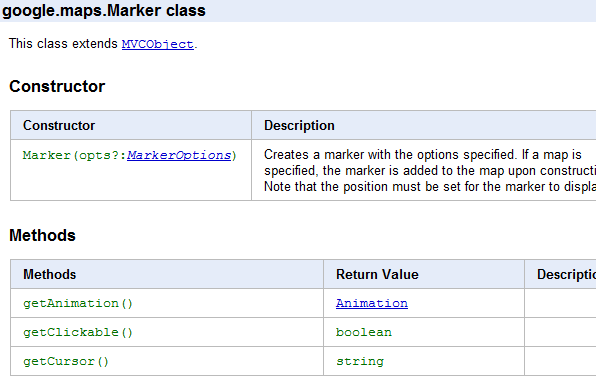
.. _JsDoc Toolkit: http://code.google.com/p/jsdoc-toolkit/
.. _Maps API v3 reference: http://code.google.com/apis/maps/documentation/javascript/reference.html
.. _the template: http://gmaps-utility-library-dev.googlecode.com/svn/trunk/util/docs/template/

PyDoc
-----

`pydoc`_ Python 모듈은 Python 코드를 실행하고 JavaDoc과 비슷한 다중 페이지 형식의 산출물을
만들어 낸다. 그런데 검색하기 더 어렵다. 게다가 기본 산출물은 별로 이쁘지 않다.
Google은 현재 이것을 Google data `Python client library`_ 레퍼런스에서 사용한다.

|gdatareference|

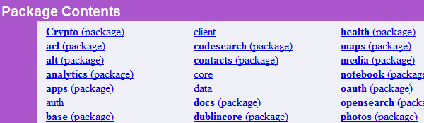
.. _pydoc: http://docs.python.org/library/pydoc.html
.. _Python client library: http://gdata-python-client.googlecode.com/svn/trunk/pydocs/gdata.html

Sphinx
------

`Sphinx`_ 도구는 `reStructuredText`_-스타일 포멧을 사용하는 소스코드(또는 어떤 텍스트던지)를 
문서화하기 쉽게 해준다.  원래 새로운 Python 문서를 위한 문서를 산출하기 위해 만들어 졌기 때문에, 
Python 개발자들은 이것의 기본 산출물을 즉시 인지할 것이지만, 다른 언어에서도 사용되기도 한다. 
그리고 지금 이 handbook 처럼 code를 쓰지 않는 문서에도 사용된다.

`Sphinx`_ 레퍼런스 정보를 본문형태 설명과 같은 다른 내용과 섞을 수 있어서, 전반적인 개발자 지침을 
작성하기에 좋은 방법이 될 수 있다.  단일 페이지 또는 다중 페이지, 기본 산출물도 깔끔하고 좋아보인다.
단지 소스파일에 다른 명령을 실행하는 것으로 LaTex 나 PDF 같은 다른 포맷으로도 산출물을 뽑아낼 수 있다.

만약 여러분의 코드에 대해 reStructuredText를 아직 사용하고 있지 않다면, 그 포맷을 배우는 것과 
주석을 변경하는데 시간이 좀 걸릴 것이지만, Python API를 이용을 경험해 보는 것도  가치있는 시간이다.

pydoc을 시작한 후, 우리는 `Wave Robots API Python library`_ 레퍼런스에서 Sphinx를 사용하는 것으로 바꿨다.

|wavereference|

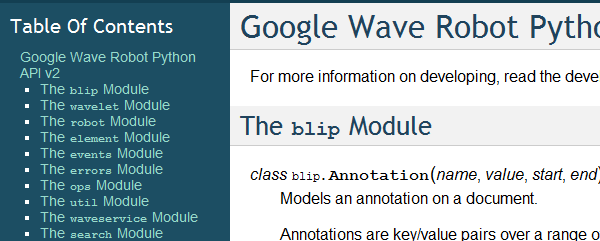
.. _Sphinx: http://sphinx.pocoo.org/
.. _reStructuredText: http://sphinx.pocoo.org/rest.html
.. _Wave Robots API Python library: http://wave-robot-python-client.googlecode.com/svn/trunk/pydocs/index.html

ASDoc
-----

Adobe는 개발자들이 그들의 사이트에서 제공하는 것들과 같은 다중 페이지 레퍼런스를 만들기 
쉽게 `ASDoc`_ 을 제공한다.  ActionScript 개발자들은 이미 core AS3 라이브러리를 사용했을 때부터 
이미 이 포맷을 사용하고 있다. AS3 라이브러리를 제공하고 있다면, 익숙하고 좋은 포맷이다.

우리는 ASDoc을 Flash Maps API에 대해서 다운로드 가능한 다중 페이지 레퍼런스를 만드는데, 
보다 우리의 다른 API들처럼 보이도록 script를 온라인 상의 단일 페이지 레퍼런스 변경하데 
사용하곤 했다.  우리는 Flash 개발자들과 Maps API 개발자들 양쪽 개발자들이 오길 기대했기 
때문에 그들이 사용하던 것들 간의 일관성을 갖도록 노력하고 있었다.

|flashreference|

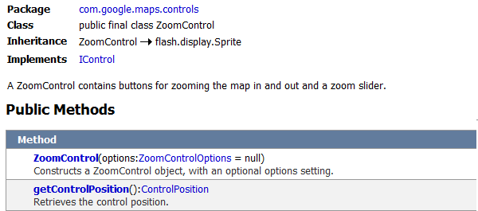
.. _ASDoc: http://livedocs.adobe.com/flex/3/html/help.html?content=asdoc_1.html

.. _changelog:

변경기록
*********

API를 문서화 할 때, API가 언제 어떻게 변경되었는지도 문서화해야 한다.
변경기록은 변경된 행위, 신규 API, 중단 예정인 API 들을 레퍼런스나 블로그 
글의 적절한 링크와 함께 나열해야 한다. 어떤 개발자가 직면할 수 있는 버그가 
고쳐졌는지와 함께 이슈 트래커에서 추적되었다면 그 이슈의 링크도 제공해야한다.

우리는 Maps API에 대해서 이슈 트래커 프로젝트 내에 있는 `위키페이지 <http://code.google.com/p/gmaps-api-issues/w/list>`_ 에 
변경기록을 게시한다. 변경된 이슈에 링크를 쉽게 걸 수 있고, RSS feed를 제공
할 수 있다. 원한다면 변경사항 wiki들에 어떤 변경이 있는지 구독할 수 있다.
(참고: 공지사항 목록에도 변경사항에 대해 게시해야 한다).

`Google Analytics Data Export API`_ 와 `Google Sites API`_ 같은
다른 Google API들은 그 문서 안에 페이지들처럼 변경사항을 게시한다. 

|analyticschangelog|

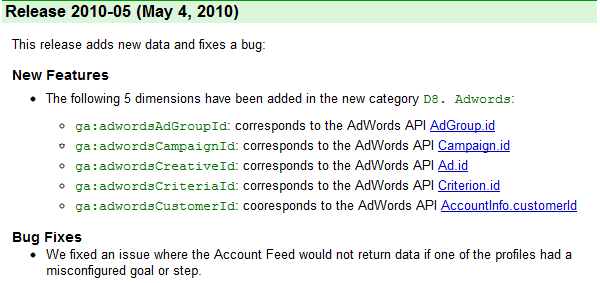
.. _Google Analytics Data Export API: http://code.google.com/apis/analytics/docs/gdata/changelog.html
.. _Google Sites API: http://code.google.com/apis/sites/changelog.html

.. _code-samples:

코드 샘플
*********

API 아래에 개념을 설명하고 레퍼런스에 있는 모든 객체들을 나열하는 것은 중요하지만, 
실제로 그 API를 사용할 때 샘플 코드 제공은 매우 중요하다. 만약 개발자가 샘플코드를 
통해 하는 결과를 만드는 코드를 만들 수 있다면  즉시 코드를 고쳐 필요한 기능을 만들 수 있다.

물론 샘플 코드를 그대로 복사-붙여넣기하고나서 아무것도 못하는 초보 개발자들이 있다.
그들은 기본적으로 포럼내의 개발자들에게 샘플의 나머지 부분에 대해서 물어본다.
좋은 샘플 코드를 제공 하면 실제 API를 배우는데 열중하지 않는 개발자가 몰려올 가능성은 있다.
하지만 그런 위험보다 이점이 더 많다.

Google 샘플 코드는 실제(이론적이지 않은) API를 사용하는 것이어야 하고,
주석이 달려 있어야 하며, 적합한 라이센스(예, Apache)를 가지면서 바로 실행 가능해야 한다.
개발자가 사용하기 전에 작동하는지 시험할 수 있어야 하므로, 문서의 아래 부분에 링크가 
걸려 있고 검색이 가능해야 한다. 코드 샘플 저장소를 확대하기를  원한다면,
외부 개발자들이 만든 샘플을 공유할 수 있는 방법도 마련해야 한다.

우리는 Google API 전역에 거쳐 코드 샘플을 보여주는 2가지 다른 방법을 갖추고 있다.

`Maps API demo gallery`_ 는 발행된 Google 스프레드시트에서 
데이터를 가져올 JavaScript를 사용한 단일 페이지이고, 
개발자들이 데모들을 검색하고 살펴볼 수 있다.

링크도 달려있고 검색도 가능하지만, 전체적으로 AJAX 주도로 만들어서져서 
검색엔진에 의해 색인되지 않는다. 이는 개발자의 질문에 답할 수 있는 데모를 
찾기 위해서 데모 갤러리가 존재한다는 것을 알 수 없다. 하지만, 본인이 개발자 
포럼에서 갤러리내 빠른 검색에 대해서 응답했던 횟수로 비추어 보면, 대부분
개발자들이 그런 갤러리가 존재하는지 살펴볼 생각을 하지 않는다.

이 방법의 또 다른 단점은 구글러들이 각 샘플에 대한 정보안에서 입력해야 하므로,
일정한 시간이 걸리고 많은 샘플이 있는 규모로 쉽게 확장되지 않는 것이다.

|mapsgallery|

`Wave Samples Gallery`_ 는 App Engine app (`Open Source`_) 이다.
외부 개발자들은 인증 후, 샘플 코드를 제출하려고 양식을 작성할 수 있다. 작성 후
검토 상태로 들어가서 관리자들 그룹으로 메일이 간다. 우리는 그것을 확인하고, 
단지 버튼을 한번 클릭하는 것으로 갤러리에 보이는 것을 승인할 수 있다.
각 샘플들은 그 자체 페이지를 갖게 되고, 각 작성자들은 그 자체 페이지를 갖게 되며, 
웹 검색 엔진이 가져갈 수 있다. (robots.txt에 의해서 크롤링 가능하다.)

미묘한 이슈 하나는 이 데모 엔진은 기본적으로 데이터 저장소를 전문 검색하지 않으므로
자체의 검색이 힘들다. 이를 방지하려면 태그로 기본적인 것을 걸러낼 수 있게 하고,
구글의 사이트 전문 검색을 쓰면 된다.

이를 통해 우리는 초기 작은 샘플 코드 수가 매우 쉽게 많아져서 성장할 수 있다.
(결국 해프닝으로 끝나버린 Wave API에서도 많은 흥분을 제공했다.). 하지만, 성장력은 
약점을 갖는다. 첫째로, 갤러리에 있는 것 중 실제로 무엇을 써야하고 거부해야 할지 
결정하기 어려워진다.  일부 샘플들은 흥미롭지 않아도 누군가는 찾고 있는 것을지 모른다.
둘째로, 샘플 갤러리가 상당히 성장했을 때, 개발자들이 전형적인 기본 샘플을 찾는 것이
더욱 어려워진다. -- 단순한 샘플이 처음 시작하는 사람에게는 가장 쉽다. 이를해결하기 위해, 
우리는 "Best Practices"와 "By Googler" 필터를 샘플 갤러리에 추가했지만, 완벽한 해결 
방안은 아니다.

|wavegallery|

`Google Data APIS`_ 같은 API들은 Googler가 만든 샘플의 목록을 단순히 단일 페이지 목록에 포함한다. 
이것은 사용 사례나 개발자 수가 적은 단순한 API에 대해서 적용하면 된다.

|gdatagallery|

.. TODO: Mention Chrome Extensions Samples

여러분의 API에서 사용하는 것이 무슨 포맷인지 알 때, 적은 수의 목록을 나열하는 것과 
다양한 샘플들을 나열하는 것 분 어떤 것이 개발자들에게 이득인지 신중히 고려 하고, 
모든 경우에 여러분의 해결 방법은 검색 가능하고 링크가 달려 있어야 한다.

.. _Maps API demo gallery: http://code.google.com/apis/maps/documentation/javascript/demogallery.html
.. _Wave Samples Gallery: http://wave-samples-gallery.appspot.com/
.. _Open Source: http://google-wave-resources.googlecode.com/svn/trunk/samples-gallery/
.. _Google Data APIs: http://code.google.com/apis/gdata/samples.html
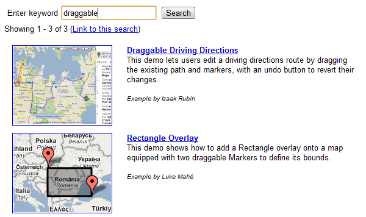
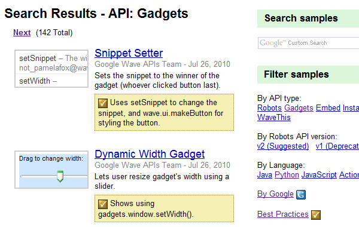
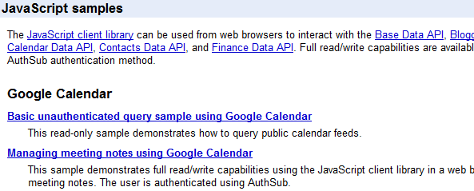

.. _code-playground:

코드 개발터
***********

일부 API 사용을 시작하는데 환경을 설정하는 것은 때때로 개발자들에게 많은 작업일 수 있다.
-- 때로 너무 많은 작업이라서 그것을 해보지도 못한다. 만약 개발자가 여러분의 사이트에서 
어떤 설정도 하지 않고 바로 실행 시켜 볼 수 있다면,  API에 대해 흥미를 갖을 것이고, 
향후에 기꺼이 사용하는 노력을 할 것이다. 동적인 코드 개발터가 문서에 대한 좋은 보완책이 
될 수 있다.

클라이언트 및 서버 사이드 또는 HTTP API 어느 것이냐에 따라, 코드 개발터는 다른 형태가 된다.
Maps API와 약 20개의 다른 API들을 포함하는 AJAX API에 대해서 우리는  
`Google Code Playground`_ 를 제공한다. 이 개발도구를 사용해서 개발자는 왼편에서 일부 샘플을
선택할 수 있고, 코드의 결과를 미리 보고 수정하고 끝난 후 저장하거나 내보내기를 할 수 있다.

이러한 방법으로 초기 작업을 해보고 준비 되었을 때, 간단한 작업 만으로 자체 개발 환경으로 
변경할 수 있다. 이 프로그램은 App Engine 상에서 실행되고, 소스코드는 
`google-ajax-examples repository`_ 에 공개되어 있다. 다른 API들도 그 자체 목적을 위해서 
변경해서 재사용할 수 있다. -- Google의 `HTML5 playground`_ 또는 Google 이외에 
`Mapstraction playeground`_ 같은 것들을 말한다.

|ajaxplayground|

HTTP기반의 Google data API들 중 일부는 그 프로토콜과 의사소통할 수 있는 인터렉티브한 
몇개의 애플리케이션을 제공한다.  `OAuth playground`_ 는 일부 API에 대한 인증 토큰 확인을
쉽게 하고 일부 URL상에서의 GET 또는 POST 요청을 수행한다. 이 playground는 개발자들이 
스스로 코드를 작성하기 전에 API의 결과를 미리 보고 미묘할 수 있는 그들 자체 응용프로그램 
내에서의 OAuth 흐름을 디버깅할 수도 있게 도와준다. 
이 프로그램은 `gdata-sampes repository`_ 에 소스가 공개되어 있고, 다른 OAuth 기반 API 
작품에서 재사용될 수도 있을 것이다.

|oauthplayground|

내가 가장 좋아하는 Google 이외의 playeground 제품 중 하나는 `Flickr API explorer`_ 이다.
이것은 Flickr XML-RPC API의 최상위를 포함하여 모든 파라미터들을 지정해서 브라우저 내에서 
그 결과를 볼 수 있다. 추가로, Flickr의 photoset에 기반한 파라미터에 대한 추천값을 
제안하기까지 한다. 내가 Flickr api를 사용할 때,  내가 어떤 것을 어떻게 할 수 있는지 궁금할 때 
난 항상 Flickr api explorer부터 본다.

|flickrexplorer|

지금까지 언급한 코드 개발터는 많은 기능을 제공한다 - 개발자들을 사로잡기에 좋은 방법이고, 
API를 테스트하고 디버그하기 쉽게 하고, 또한 API를 가르치고 설명하기에 멋진 도구들이다.

.. _Google Code Playground: http://code.google.com/apis/ajax/playground
.. _google-ajax-examples repository: http://code.google.com/p/google-ajax-examples/source/browse/#svn/trunk/interactive_samples
.. _HTML5 playground: http://playground.html5rocks.com/
.. _Mapstraction playground: http://mapstraction.appspot.com/
.. _OAuth playground: http://googlecodesamples.com/oauth_playground/
.. _gdata-samples repository: http://code.google.com/p/gdata-samples/source/browse/#svn/trunk/oauth_playground
.. _Flickr API explorer: http://www.flickr.com/services/api/explore/?method=flickr.photos.search
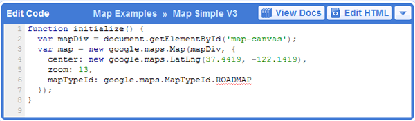
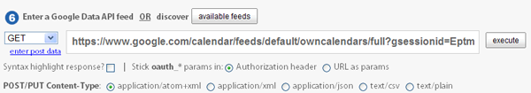
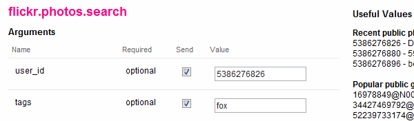

.. _developers-guide:

개발자 안내서
*************

개발자 안내서는 API를 어떻게 사용하는지에 대한 검토(walkthrough)이다. - 
그것은 강사가 학생들에게 그 API에 대해서 어떻게 설명하는 것인지와 같은 것이지만, 
온라인 출판물로 존재한다. 학생들 몇몇은 그 API가 처음일 것이고, 몇몇은 웹 개발이 
완전 처음일 것이고 또는 오래된 전문가일 것이다. - 지침은 모두를 위해 작업해야 한다.

최소한 안내서는 API를 어떻게 시작하는지 설명해야 하고, 샘플 개발 코드에 대한 지식이 
전혀없는 개발자를 끌어와야 한다. 만약 샘플 코드에서 개발 동기를 얻을 수 있다면, 
단지 레퍼런스를 사용하는 API를 살펴보는 것 보다 훨씬 뛰어나다.

가능하다면, 안내서는 교육 형식을 통해서 최고를 배우려는 개발자를 위해서 API의 모든 
면을 검토하고 있어야 한다.

|mapsdevguide|

`Maps API Developer's Guide`_ 는 종합 안내서의 한 예이다.
안내서에는 API 각 부분이 어떻게 동작하는지에 대해 설명한 페이지가 있다.
그 스팩트럼의 반대쪽에, Flickr API는 그들의 HTTP API가 어떻게 작동하는지에 대한
`few paragrphs`_ 만 제공하고, 다음에 여러분이 API 사용을 시작하도록 API explorer로 
링크를 걸어 준다.

종합 안내서는 HTTP API 보다는 JavaScript API를 위해 더 필요할 것 같다. 
HTTP API가 모든 실행에 대해서 전형적으로 똑같은 요청/응답 패턴인데 반하여, 
JS API는 그것의 다른 부분이 사용되는 방법을 바꿀 수 있기 때문이다.
(참고로 Flickr는 `user authentication`_ 상에 추가적인 문서를 제공하고, HTTP 요청만큼 
직접적인 주제는 아니다.

길이와 상관없이 안내서는 문서의 다른 부분들을 연결해야 한다 - 
레퍼런스, 샘플, playground, 기사 - 그래서 그 개발자들은 그 자원들이 존재하는지 이해하고, 
이후에는 스스로 그것들을 조사할 것이다.

.. _Maps API Developer's Guide: http://code.google.com/apis/maps/documentation/javascript/basics.html
.. _few paragraphs: http://www.flickr.com/services/api/misc.overview.html
.. _user authentication: http://www.flickr.com/services/api/misc.userauth.html
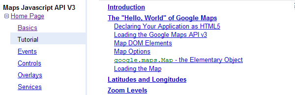

.. _articles:

튜토리얼
*********

개발자 안내서가 API의 기본 사용법과 그 기능을 전체적으로 개발자에게 
알려줄 수 있다고 해도 같은 방법으로 모든 가이드를 해 줄 수는 없다. 
즉, 개발자에게 또 다른 서비스, 프레임워크, 또는 API를 조합하는 것과 
같은 API의 특수한 사용방법을 가르칠 때는 튜토리얼이 필요한 것이다.

예를 들어, Maps API와 PHP & MySQL을 조합하는 것에 대한 튜토리얼이  
내가 썼던 것 중 가장 인기 있었다. 난 데이터베이스로부터 지도위에 마커들을 
렌더링 하는 `basic article`_ 을 시작했고, (분석 및 포럼 게시물 양쪽에서)
그 기사를 읽은 개발자 수를 본 후, 나는 관련된 글을 쓰기 시작했고, 
그것들을 다시 링크 걸었으며, 이후에는 연재물 형태와 비슷하게 되었다.

튜토리얼 형식은 다양하다. - 일부는 (PHP/MySQL 튜토리얼 처럼) 시작부터 
최종 결과물까지 순서를 보여주는 것도 있고, `Debugging Wave Robots`_ 같은
팁 모음, 그리고 몇몇은 `Using Debugging Tools with the Maps API`_ 
같이 시각적으로 과정을 설명하는 스크린캐스트가 될 수 있다.

|screencast|

이 각각의 형식들은 서로 다른 개발자들에게 호소하고 다른 내용에 대해 작업하고, 
다른 형식을 취한 실험과 청중과 API에 대해 무엇이 동작하는지를 보여주는 
좋은 것이다. 

운이 좋다면, 외부 개발자들이 쓴 많은 논설과 튜토리얼들을 볼 수 있을 것이다.
할 수 있다면, 그 글들의 링크를 수집하도록 하고, 
(그 글들이 비공식적인 것이라고 표시해서) 여러분 소유 문서에 제공해야 한다. 
그 글을 쓴 사람들의 사이트 트래픽을 높혀주므로 그들에게도 좋고, 고마워서 
글을 더 많이 쓸 것이고, 다른 관점에서 쓰여진 추가 자원들을 살펴 볼 수 있기 때문에
개발자들에게도 좋다. 이들을 관리하기 위해서, 일반적으로 외부글들을 북마크 하고, 
나의 알림 또는 트위터 스트림을 한달에 한번씩 보며, 그것들에 대한
우리의 튜토리얼 페이지와 블로그에 추가한다.

우리 API 문서 사이트에 대한 분석에 따르면, 
개발자들은 주요 개발자 안내서보다 튜토리얼 섹션을 방문할 가능성이 적다.
아마도 그들은 해답을 "주요" 개발자 안내서에서 찾을 것으로 추측되기 때문이다. 
개발자들이 튜토리얼으로 들어가는 것을 늘리기 위해서, 그 문서를 관련되고 의미있는 
글에 링크거는 것을 추천한다.

.. _Using Debugging Tools with the Maps API: http://code.google.com/apis/maps/articles/debuggingmaps.html
.. _Debugging Wave Robots: http://code.google.com/apis/wave/articles/robotdebugging.html
.. _basic article: http://code.google.com/apis/maps/articles/phpsqlajax.html
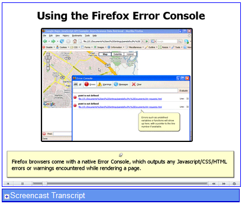

