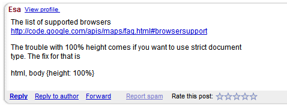

포럼 지원
#############

API 제공 업체의 주 목표는 개발자들이 당신의 API를 성공적으로 사용하는 것을 확실하게 하는 것이다.완벽한 세계에서, 개발자는 문서를 읽고, 샘플코드를 참고하여 개발자들이 생각하는 어플리케이션을 정확하게 작성할 수 있다.그러나 세상은 완벽하지 않고, 더 구체적이지 않기 때문에, 당신의 API는 완벽하지 않고 문서도 100% 완성될 수 없다. 사실, 어떻게 개발자들이 당신의 API를 사용하길 원하는지 예측하는 것은 불가능에 가깝고, 당신의 API가 사용 되어질 수 있는 무수하게 많은 모든 방법을 문서화 하는 것은 불가능에 가까울 것이다.그렇기 때문에, 당신은 질문을 하고 그들의 어플리케이션 디버깅을 도와주기 위한 포럼을 제공 함으로서 당신의 개발자들을 돕는 것을 필요로 한다.

무한한 시간이 제공되면, 최종 목표는, 문서는 그룹 안의 자주 물어보게 되는 질문들과 유즈 케이스를 커버하는 것이 될 것이다. 그러나 자원은 한정되고, 좋은 포럼 지원을 제공하는 것은 항상 성공적으로 개발자들을 만드는 큰 부분 일 것이다.

API 지원 포럼의 궁극적인 목표는 사용자 커뮤니티를 구축하는 것 그리고 이러한 사용자가 서로 도울 수 있도록 하는 것이다. 이상적으로, 게시글들의 대부분이 API에 대해 열정적이고 다른 사람들을 도와주는 것을 즐기는 super user에 의해 답변 된다.

포럼 기능들
**************

포럼 기술을 논하는 여러가지 옵션들이 있으며, 각각의 포럼들은 여러 기능들을 가지고 있다.다음은 찾기 위한 몇 가지 표준 기능이다.

* :ref:’이메일 구독’: 만약 당신이 스레드에서 개발자 응답을 원한다면, 그들은 새로운 스레드를 게시 될 때 아는 쉬운 방법이 필요하다.
* :ref:’rss-feeds’: 더 캐주얼한 개발자들은 피드들을 선호할지 모른다. 그렇기 때문에 그들이 좋다고 느낄 때 새로운 스레드를 열람할 수 있다.  
* :ref:’스팸-처리’: 공개 포럼들은 스펨에 취약하기 때문에 좋은 발견과 억제는 필수 이다.
* :ref:’게시자-통계’: 만약 눈에 보이는 통계에 기여하고 있다면, 개발자들은 더 게시를 잘 할 것이다

다음은 포럼옵션들이다.

* `Google Groups`_: 이메일, RSS, 스팸 처리를 포함하지만 통계나 뱃지는 충분하지 않다.
* `Stack Overflow`_: 모든 기능과 훌륭한 계층 badging 시스템. 주 결점은 모두 하나의 큰 포럼이고 특정 API를 중심으로 커뮤니티를 형성하는 것이 힘들 수 있다는 것이다.
* `GetSatisfaction`_: 모든 기능 과 포스트 프로세싱에 특별한 생각을 넣는다. 질문, 아이디어, 버그, 칭찬 게시글들을 구분한다; 유사한 질문을 찾는다; 게시자에게 게시 방식 팁을 준다; 태그 추가와 게시글에 대한 느낌을 격려한다.
* `phpBB`_: 모든 특징과 오픈소스 이며 웹에서 구동되는 오리지널 포스팅 시스템 중 하나이다.
* `ZenDesk`_: 모든 기능과 1대1 고객 지원 티켓이나 글로 스레들을 설정하는 기능을 포함한다.

특징들은 아래에서 다양한 포럼 기술들에 대해 더 자세히 논의 된다.

.. _Google Groups: http://groups.google.com
.. _Stack Overflow: http://stackoverflow.com
.. _GetSatisfaction: http://getsatisfaction.com
.. _phpBB: http://phpbb.com
.. _ZenDesk: http://zendesk.com

.. _email-subscription:

이메일 구독
==================

내 경험에 비추어 봤을 때, 개발자 포럼의 가장 중요한 특징은 사용자들은 이메일을 통해 회원가입을 하고, 답변을 받을 수 있다는 것이다.이것은 질문의 회신에 대한 낮은 장벽을 의미하고, 개발자들은 그들의 이메일 혹은 뉴스 그룹 리더의 선택을 그룹안에 그들과 상관이 있는 사람들을 관리 하는 것을 사용할 수 있다.

어떤 포럼은 이메일 구독을 제공하지 않을지 모르지만, 포스팅에 답변이 되거나, 매주의 콘텐츠의 요약을 이메일로 사용자들에게 보내줄 것이다. 이것은 옳은 방향으로 가는 단계이지만, 이것이 사용자 응답을 격려한다고 생각하지 않는다.

.. _rss-feeds:

RSS 피드
=========
만약 최근의 주제들과 포스트들을 구독 하는 기능이 제공된다면 좋다. 몇몇의 개발자들은 이메일을 통한 구독을 즐겨 하지 않지만, RSS 피드를 그들의 리더에 붙이고 가끔 힐끔본다. RSS 피드 (#주어진 기간에 게시물의) 도 API 방문페이지나 포털, 분석하는 것을 가젯에 feed를 주면 편리하다.

.. _spam-handling:

스팸 처리
=============

개발자 포럼은 더 많은 회원을 장려하는 방식으로는 일반적으로 설치가 있다. ? 그들은 문서, 블로그 포스트, 이슈 트래커로 연결되어 있으며, 그들은 가입자 승인이 필요하지 않는다. 이 모든것은 커뮤니티 장려에 좋지만, 불행하게도, 이것 또한 스패머 장려에 좋다. 불행하게도, 스패머들은 잠재적으로 커뮤니티를 파괴할 수 있다.만약 당신이 그룹을 구독하고 다음날 5개의 스팸 메시지를 받는다면, 당신은 아마 이렇게 생각할 것이다. 그래, 만약 내 받은 편지함에서 스팸메시지를 받지 않는 것을 의미한다면, 난 이 그룹을 떠나 희생할 생각이 있어.”

이상적으로, 포럼은 완벽한 스팸 탐지를 가지며, 포럼으로 들어오는 모든 스팸메세지를 막거나, 당신이 허용/거부하기 위한 대기열로 보낼 수 있어야 한다. 만약 어떠한 이유로 메시지가 통과 한다면, 메시지를 지우고, 포스터 금지가 쉬어야 한다.

그러나 많은 포럼들은 완벽한 스팸 검색기능을 가지지 않기 때문에, 그들은 스팸 방지 도움에 적당한 특징을 제공한다. 예를 들면, Google Groups 는 게시글이 아닌 것, 새로운 사용자들의 첫번째 게시글, 모든 게시글을 조정하는 그룹 설정을 제공한다. High-spam-target Maps API 그룹은 높은 트래픽 때문에 두번째 옵션을 선택했다. 개발자들이 그들의 게시물이 검토 되기 전에 너무 오랫동안 기다리지 않는 것을 확인하기 위해서, 우리는 전 세계에서 온 ?미국, 영국, 호주 관리자들이 있다. 일부 매니저 들은 구글에서 일하지만 그들의 대부분은 우리의 신뢰할 수 있는 최고 게시자들 이다. 접근 권한을 누구에게 주었는지 주의하고, 포럼의 기준을 지키지 않으면 스펨이 아니더라도 포럼에 글을 게시하는 것이 거부될 수 있습니다. 의문이 있는 경우에는 통과시켜라.검열의 고발을 함으로서 당신에게 이익이 주어지지 않고, 만약 매주 하나 혹은 두개 스팸 게시물을 올린다면 당신에게 손해를 입히지 않는다.

.. _poster-statistics:

게시자 통계
=================

사람들은 상이나 높은 점수를 받고 보여지는 것을 좋아한다. 이것은 어리석고 자기중심적일지도 모르지만, 그것이 인류의 특징이고, 포럼은 더 많은 게시물을 위해서 사람들을 격려하는 기능/결함의 유리함을 가져갈 수 있다. 어떤 포럼에 있어 기본통계는 가입 날짜와 게시물 수를 노출 할 수 있다(그래서 당신은 누가 오래된 사용자인지 안다). 그리고 이것은 더 많은 포스팅을 격려하고 새로운 사람들에게 스레드 안에 있는 다른 사람의 경험 레벨을 이해 시켜준다.

아래 스크린샷은 실제 사용되어지는 PHPBB 표준 설치를 보여준다. 다음의 각각은 게시물에 짧은 사용자 프로필은 아바타, 가입일, 게시물 수를 보여준다.

|phpbb|

.. Ref: http://area51.phpbb.com/phpBB/viewtopic.php?f=72&t=31310

그러나 제공된 기본 통계는 속일 수 있다는 것을 명심하라. 이론적으로, 개발자는 1000개의 정보 없는 게시글을 게시할 수 있다. (또는 막대한 양의 도움을 얻는다). 운 좋게도 이것은 보통 발생하지 않는다. 운 좋게도 이것은 보통 발생하지 않는다. 나쁜 개발자가 적은 수의 게시글을 통해 좋은 개발자가 되거나 적당한 작업기술과 이동에 접합하지 않다고 알고 있다.

극히 드물게, 규칙을 지치기 않는 유해한 개발자가 나타날 것이다. Map API 그룹에서, 우리는 스팸이 아니었던 텍스트 단락을 게시하려는 개발자를 한번 가졌다. 그러나 우리는 매우 잘못 알고 있었고, 그는 관계가 없는 스레드에서 이것을 게시할 것이다.(일반적으로 “hijacking” 이라고 한다.) 포럼의 다른 사람들은 그에게 포럼의 방법을 가리쳐주는 것에 친절하려고 노력했다, 그리고 그가 그들을 존경하지 않는 것이 분명해진 후, 나는 그를 영구제명 하고 그에게 알리려고 메일을 보냈고, 그는 지침에 따라 최대한 오래 그를 다시 보고자 할 것이다.그것은 스팸 사용자를 금지하고 있던 시간 뿐이지만, 나는 극단적인 스텝을 만족하고 있다. 그는 커뮤니티에 유해했고, 스스로 복귀를 거절했다.본래의 논의로 돌아가자 ? 또한 그는 우리의 그룹 통계 페이지에 따려면 최고의 게시자 였다. 월별 최고 게시자와 같은 짧은 기간 통계는 포럼에서 잠재적으로 떠로르는 스타를 찾는데 유용하지만, 또한 아직 얻지 않은 새로운 사람을 가리킬 수 있다. ? 그래서 어떻게 통계를 사용하는지를 유의 해야 한다.

지금, 그 반대로, 많은 경험을 가진 개발자 들은 종종 게시글을 올리지 않지만, 글을 올리게 되면 놀라운 지식들이 나온다.종종 높은 기술의 한 분야에서 전문 개발자를 위한 경우에, 그래서 아주 특별한 경우에 응답하거나 또는 개발자를 위한 일정 변경, 그리고 일을 쉬거나, 어려운 기술을 실제로 사용할 때 게시글을 찾는 시간을 가진다. 게시글 통계로는 개발자 식별이 어렵지만, 그들의 게시글 일부의 질로 구분하는 것이 일반적으로 쉬운 방법이다.

만약 포럼이 포스팅 율을 사용자에게 허용한다면, 게시글의 평균 순위는 통계가 가능하다. 그러나 평가의 힘은 위험요소이다. 이것은 누가 게시글에 자주 좋은 대답을 하는지 구분하는데 좋게 사용되어질 수 있지만, 종종 나쁘게 사용되기 쉽다 -  그들이 원하는 대답이 아닐 경우 좋지 않다고 평가 하기 때문이다(올바른 경우에도). 나는 자바스크립트 API 포럼에서 플래시 API를 알렸을때 가장 낮은 게시글 평가를 받았었다. 그리고 나는 그 포럼에는 플래시를 절대 적으로 싫어하는 하드코어 자바스크립트 개발자들이 많다는 것을 알았고, 심지어 그 언급에 대해 당신을 벌할지도 모른다. 이것은 게시글에 일반적인 별 등급 위젯을 제공하고 그 의미에 대한 어떠한 지침을 제공하지 않는데에 근본적인 결함을 반영한다. 의도된 의미는 “답변이 도움이 되었는가?”가 되어야 하지만, 어떤 사용자 들은 “게시글의 정보가 당신을 행복하지 않게 만들었는가?”라는 의미로 받아 들이고, 평가 정보에 대한 기능을 잃는다. 아래의 스크린샷은 Google Groups의 문제를 경험한 평가 인터페이스를 보여준다:

|groupsrating|

.. Ref: http://groups.google.com/group/google-maps-js-api-v3/browse\_thread/thread/8b1c45197229950b

이상적으로, 포럼은 게시자에게 피드백 메커니즘에 관한 더 많은 가이드를 제공해야 하고, 이것은 더 안정적인 데이터를 가져올 것이다. Google Maps는 이것을 제공하는 포럼 기술을 가지고 사용하고, 이것은 질문-답변 상황을 타겟으로 한다.포스트에 대한 각각의 응답(답변)에서, 뷰어는 질문을 대표한다. “당신의 질문에 답변한적 있습니까? 네/아니오”, 그리고 데이터는 리스트 뷰의 답변 스레드를 가리키는데 사용된다. 이론적으로, 이 데이터는 게시자의 통계가 될 수 있다. 그러나 명확하진 않다. 아래의 스크린샷은 한명의 사용자에 의해 질문이 답변으로 표시되는 게시글을 보여준다:

|u2urating|

.. Ref: http://www.google.com/support/forum/p/maps/thread?tid=12cf111e77d6b0d4&hl=en

프로그래밍 이슈에 대한 특별한 포럼인 Stack Overflow는 최고 평가 인터페이스를 제공한다.다음의 각각의 포스트는 위 아래 화살표가 보여진다. 화살표 위로 올라가면 “이 답변은 도움이 됩니다.” 또는 “이 답변은 도움이 되지 않습니다” 라는 툴팁이 보여져서, 사용자들은 이것이 투표를 의미하는 지를 알수 있게 된다. 추가하자면, 15이상의 명성의 사람들만 모든 투표에 허용된다. 개발자들은 좋은 질문 또는 좋은 답변으로 명성 포인트에 참여하고, 이것은 약간 도움이 되는 게시글들이 15포인트를 가져가기 때문에 이 제한은 비교적 낮게 세팅된다. 이것은 새로운 사람들은 투표를 할 수 없기 때문에 화나게 할지 모르지만, 이것은 사용자를 인증하기 위한 기다림을 통하여 시스템을 이해하고 커뮤니티에 공헌하는 것을 도와준다. 그 투표 데이터는 사용자의 전반적인 명성에 기반이 되며, 또한 프로필 페이지에 자세하게 보여진다.

아래 스크린샷은 StackOverflow 페이지의 답변을 보여준다.화살표 위로 올라갔을 때 툴팁 알림과 응답자의 작은 프로필 옆에 통계를 보여준다.

|stackoverflow|

.. Ref: http://stackoverflow.com/questions/710392/using-spring-ioc-to-set-up-enum-values

평가의 또 다른 이슈는 사람들은 긍정적인 감정 때 보다 부정적인 감정 때 더 자주 평가를 하는 경향이 있다는 점이다 ? 그래서 평가는 낮은 쪽으로 기울어지고, 만약 평가 데이터가 충분하지 않다면 그 기울어 짐은 해결되지 않을지도 모른다. Google Groups는 많은 게시자들이 이메일을 통해 구독하기 하기 때문에 웹 인터페이스의 평사 시스템을 보지 않아 데이터의 부족을 경험한다. 웹 전용 포럼에서, 특히 몇 명의 스타들을 클릭하는 것 같이 쉽다면 평가는 훨씬 더 일반적으로 될 가능성이 높다.  

웹의 모든 사람들은 평가위젯을 주도록 요구하고 있는 것 같다. ? 이것은 민주적인 방식이며 피드백을 받는 가장 간단한 폼이다. 지금 보다 시피, 간단한 문제가 아니다. 포럼에서 평가를 사용하거나 투표가 가능한지 아닌지를 결정할 때에는 위의 내용을 명심하라.

.. |phpbb| image:: ./screenshot_phpbb.png

.. |u2urating| image:: ./screenshot_u2uratings.png

.. _badging-system:

뱃지 시스템
==============
뱃지 시스템은 대안 혹은 순위시스템의 지원을 제공할 수 있다. 이것은 개발자 보상의 목표 뿐만 아니라, 평가의 문제를 피하면서, 응답의 경험 수준을 드러내는 것에 목적을 수행할 수 있다. 일반적으로, 포럼은 게시자가 얻을 수 있는 다양한 뱃지 레벨을 가지고 있을 것이고, 그 래벨들은 새로운 멤버에서부터 경험많은 개발자, 그룹 관리자까지 커버하고, 참여의 양을 포함한 참여의 여러 종류를 나타낸다.

예를 들면 오픈 소스 게임 엔진인 Ogre3d는 그들의 포럼에서 PHPbb를 사용하고, 그들은 다음의 뱃지를 사용합니다: “새로운사람”, “익숙한 얼굴”, “정규 맴버”, “베테랑”, “OGRE 공헌자”(오픈소스 커밋터), “브론즈 스폰서”(프로젝트 기부자), “OGRE 전문가”, 그리고 “OGRE 중재자. 그 뱃지들은 각각의 게시물의 작성자 이름옆에 보여진다. 아래의 스크린샷은 OGRE 포럼의 새로운 사람과 중재자 사이의 게시물에서 나왔다:

|ogre|

.. |ogre| image:: ./screenshot_phpbbbadges.png

.. Ref: http://www.ogre3d.org/forums/viewtopic.php?f=1&t=52312#wrap
.. TODO: Encouraging top posters
.. TODO: Encouraging good posting

포스팅 지침
**********************

비록 목표는 포럼이 사용자의 게시물에 의해 주도되어 지지만, API 공급자의 대표는 항상 포럼을 모니터링 해야 하고, 그것은 건강하고 그들의 대답이 필요한 질문 이라는 것을 보장 한다. 그들이 모든 게시물에 대한 응답이 아니더라도, 사용자들은 API 제공자의 관리를 받는 것을 느낄 것이다. 그것은 버려진 지원 포럼보다 아무것도 나쁜게 없고, 당신은 그들이 실제로 당신을 필요로 할 때 당신이 그들에 있다는 것을 확실히 하는데 최선을 다해야 한다. 포럼을 모니터링 하는 또다른 이유는 주요중단 또는 버그들을 조심하기 위해서이다.내 경험에 비추어 보았을 때, 주요한 버그는 짧은 시간 안에 포럼 게시글들의 혼란을 일으킬 것이다. 그리고 포럼 모니터링은 종종 주요한 버그를 찾아내는 빠른 방법 이다.

포스팅 시점 결정
=====================

API 제공자는 포럼에 게시하는 두가지 상황이 있을 것이다. 첫번째 상황은 그들 스스로 새로운 스래드가 시작 될 때, 그리고 그 상황이 “개발자 커뮤니케이션” 부분에 자세히 설명되어 있을 때 이다. 또다른 상황은 개발자 시작 스레드에 응답하고 그것이 우리가 여기서 다루는 것일 때 이다. 

스레드에 회신 여부를 결정할 때, 염두에 두어야 할 것이 두가지가 있다. :

- 그것은 항상 외부 개발자가 스레드에 응답하는 것을 선호하여, 포럼이 슈퍼유저의 커뮤니티라고 생각하도록 하기 쉽다.
- 이것은 공급자가 모든질문에 대한 답변을 위해 확장이 되지 않는다. 디버깅 시간이 많이 걸릴 수 있고 일부 게시자들은 특히 어렵다. 제공자는 지능적으로 묻는 최고로 긴급한 질문에 우선적으로 처리하는 것을 필요로 한다.

이러한 제약을 감안할 때, 아래의 다이어그램은 응답하는 경우에 결정하기 위한 결정 흐름을 보여준다.

|groupdiagram|

사용자가 게시글을 올릴 때, 긴급한 게시물인지 확인하기 위해 게시물을 검토한다. 일반적으로, 긴급한 메시지는 주요 결함 신호의 하나가 되고, 드물게 발생할 것이다.(물론, 그렇지 않으면 당신의 API는 나쁜 상태이다). 급한 경우, 문제를 찾고 있다고 즉시 응답하고, 그렇지 않은 경우, 일정 기간 기다린다. 기다리는 시간은 다른 개발자 들에게 게시글에 응답할 기회를 준다. 일반적으로 2일을 기다리지만, 1-7일이 될수 있다. 일단 일정기간동안 기다린 후, 게시글을 다시 검토한다. 만약 다른 개발자에 의해 답변 되고, 그 개발자가 완전한 정보로 게시물에 답변 한다면, 저장한다. 답변이 되지 않았거나, 답변이 되었더라도 그 답변이 잘못되거나 불분명 하다면, 당신이 대응해야할 후보가 된다.

다음 단계는 게시물이 API 공급자 응답에 대한 자격을 충족하는 지 확인하는 것입니다. 자격은 당신이 가지고 있는 한정된 시간이 가장 중요한 문제에 사용되고 있는지 확인하기 위해 존재한다. 다음은 내가 제공자 일 때의 내 기준이다.절대적으로 응답한다:

- 사용자는 API나 문서의 버그를 알린다.
- 당신은 외부 개발자들이 알 수 없는 질문에 대한 정보를 가진다. 예를 들어, 종종 누군가는 내부적으로 정적지도 API 할당량에 도달하고 있다고 게시하면, 슈퍼유저는 일반적으로 아무것도 할 수 있는 것이 없다고  응답한다. 사실, 그래서 나는 그들에게 무엇을 해야하는지에 대한 정보를 응답해 줄것이다. 

또한 그 질문이 오랜시간동안 좋은 답변없이 올라온다고, 유효하거나 특별한것처럼 보인다면, 당신은 응답하고자 할지 모른다. 이후로 개발자들은 종종 그들의 질문에 대한 답을 그룹을 통해 찾기 때문에, 당신은 그들은 질문에 대한 검색을 하지 않고 답변되지 않은 스레드를 간단한 검색을 통해 하기를 원할 것이다. 그것은 개발자들에게 가장 큰 좌절 경험이 될수 있다.

회신 작성
===================

당신이 스레드가 당신의 회신을 보증하는 것을 하기로 결정했을 때, 여기에 답글을 작성할 때 따라야할 몇가지 팁이 있다. 

- **친근하고 캐주얼한 톤을 사용** 적절할 때 고맙다고 말하고, 이해될때 웃는 얼굴을 두려워 하지 않는다.당신은 포럼을 긍정적인 장소로 만들고 싶어하는 것을 기억하라.
- **회신에서 포스터를 불러라** 이 두가지는 당신의 회신을 좀더 개인적이고 배려하는 것처럼 보이게 하지만, 여러 접선으로나뉠 때 스레들을 더 쉽게 읽을 수 있도록 만든다. 게시자가 게시글에 이름으로 사용하면 그것을 사용한다. 반면 사용자이름을 사용한다.
   e.g. "Hi Chris - " or "Hi dnk555 - ".
- **답변을 간결하게 만들어라** 일반적으로, 웹에서는 아무도 많은 글을 읽으려 하지 않는다. 동시에 답변은 너무 짧게 되지 않게 해야 않아야 한다. 이것은 추가 질문의 소멸을 불러일으킨다. 
- **가능하다면 다른 자원을 가리켜라** 종종, 개발자들은 질문을 물을 것이고, 그 답이 문서의 어딘가에 있을 것이다. ? FAQ, 데모갤러리 등등- 사실 그들이 질문한다는 것은 해당 부분의 문서를 읽지 않았다는 것을 나타낸다. 그것은 잘못된 행동이 아니다. ? 문서는 숙지하는데 위축되게 할수 있다. ? 그러나 당신은 개발자게에 그것을 하게 격려하기를 원할 것이다. 그래서, 항상 문서의 어딘가에 있는 답변을 찾는 것을 시도 해야 하며, 개발자에게 그 부분을 가르켜 준다. 이 예제 스레들을 확인하라. 
-  **코드만 게시하지 말고 코드 설명을 해라** 포럼의 많은 질문들은 어떻께 X와 Y를 하는지를 물어보것이다. 이것은 그들에게 코드를 돌려주도록 유혹하는 것이다, 그러나 그것은 더 좋은 개발자로 만들지 못한다. 그리고 사실 탐욕스러운 개발자로 만들고 그들은 포럼을 그들의 코드 완성 팩토리 쯤으로 생각하게 만든다. 대신, 당신은 코드와 숨겨진 원리 설명을 주기를 원할 것이다. 그들은 여전히 얻지 못했을지 모르지만, 적어도 당신은 그들에게 배울 수 있는 기회를 준것이다. 
- **감정에 사로잡히지 말아라 - 사실만 ** 어떤 개발자들은 행복한 개발자가 아니라 그들은 포럼에 감정적일것이다. 특히 그들의 사이트 안에 버그를 도입 했다면. 감정적인 응답은 돕지 않을 것이고, 상황 악화를 만들 것이다. 단지 당신의 능력을 최고로 발휘하여 기술적 문제를 해결 하라.
- **미래를 예측하지 말아라** 당신의 API를 사용하는 개발자들은 미래에 발생할지 모르는 두가지 이벤트에 흥미가 있다: 버그가 수정되는 것 그리고 기능이 실현 되는 것. API의 공식 대변인 으로서, 그들의 이벤트에 대한 타임라인을 제공하거나 또는 발생할 것을 약속하는것은 매우 위험하다. 기능이 당신의 다음 해야할 일 목록이라고 생각할지 모르지만, 그때 자연재해가 할지 모르고, 해야할일 목록의 아래로 간다. ( 또는 더 현실적으로 말하면, 더 빨리 끝내야할 기능을 찾는다). 당신이 “네. 우리는 X일에 할것입니다” 라고 말하고 그날짜에 좋지 않게 만든다면, 당신의 개발자는 당신의 전달 능력에 대한 믿음을 잃게 된다. “좋은 생각이라고 생각해요. 확인해 볼께요” 그리고 기능을 제공해 줌으로서 개발자들을 놀래키는 것이 더 낫다. 그러나, 버그 수정은 조금 다른 얘기이다. 1) 개발자는 해결에 시간을 투자 할지 여부를 결정 할 필요가 있다. 2) 버그가 당신의 실수라면, 버그를 수정할 의무가 있다. 버그 때문에 실제 코드의 변경이 있을 때, 나는 일반적으로 버그가 “처리되었지만 배포되지 않았다”라는 것을 알리고, 회기 버그에 대해서 일반적으로 버그 수정에 대한 정확한 타임라인을 제공하려고 노력할 것이다. 이 정책은 팀의 개방성에 의존해 변경될 것이고, 당신은 얼마나 많이 개발자들에 약속/시현 할지 결정해야 한다.
- **통일성있는 태도를 유지하라** 포럼에서 당신의 API에 여러명의 대표자가 있다면, 이것은 결속력있 팀이 매우 중요하다. 만약 다른 대표자가 잘못된 무언가를 포스팅 하면, 그룹에서 회신하지 않고 수정한다. 대신, 그 사람에게 이메일을 보내 에러에 대해 설명해 주고, 후속조치 회신을 권한다. 예를 들면 “업데이트 :  관찰하고 이해한다..” 또는 “팀과 함께 회의를 하고 사실…” 만약 이슈를 개발자가 게시하면, 수정하고 싶겠지만, 아마도 팀의 나머지는 영향을 주기 위한 코맨트를 동의하지 않는다. 말하기 위한 가장 안전한 것은 항상 팀이 “조사중이다” 또는 “고려중이다” 라고 말하는 것이다. 당신의 개발자 커뮤니티는 당신을 함께 일하고 좋은 현상을 만드는 팀으로 보아야 한다. 그들의 믿음을 잃지 마라. 

.. _example thread: http://groups.google.com/group/google-maps-api-for-flash/browse_frm/thread/eaee4361c3085278

포스팅 템플릿
=================

여기에 공통 교묘한 질문에 응답하는 템플릿이 있다.

**Q**: 언제 그 기능이 나옵니까? 지금 작업하고 있습니까?
A: “[X 회사]의 정책은 새로운 제품, 기능, 버그 수정을 타임라인에 공개하지 않는 것입니다.”"새로운 기능은 우리의 블로그에( 또는 changelog )에서 기다려주십시오.”

**Q**: 서비스에서 이러 버그가 발생합니다.

A: “구현해야 버그를 확인할 수 있습니다.”[X회사] 엔지니어( 또는 우리)가 확인하고 있습니다.

**Q**: 기능이 큰 도움이 될 것이라고 생각합니다.

A: “흥미로운 생각이네요, 공유해 주셔서 감사합니다. 팀에 공유하겠습니다.”
