이슈 트래킹
###########

공개 된 웹API를 개발하는데 어려운 부분중 하나는 대상 고객을 알수 없고 사용하는 방법이 쉴수없이 다양하다는 것이다. 만약 API를 회사 내부를 위한 목적으로 설계 할 경우 동료들이 어떻게 사용할지와 원하는 방향을 보다 쉽게 이해할 수가 있을 것이다. 반면 전세계에 어디서나 사용 될 목적으로 API를 설계할때 대부분 어떠한 방법으로 사용할지 예상 할 수 있지만 그렇지 못한 전혀 다른 방법으로 사용하려는 소수의 개발자들이 있다는 것을 알아 두어야 할 것이다.

최근 300,000명 이상의 개발자들이 구글맵 API를 사용하고 있으며 대부분 단순하게 페이지에서 지도를 보이고 지도 위에 마커를 적용하고 있다. 하지만 그 외 소수 개발자들은 전혀 다른 방법으로 API를 사용하고 있다. 당신은 그 소수를 무시할수 있지만 종종 이러한 혁신적인 개발자들은 많은 사용자를 끌어 모으고 다른 개발자들을 자극하게 할 수 있게 한다.

말하고자 하는 요점은 당신의 API를 사용하는 모두에게 최소한 완벽하지 않다라는 것이다. 당신의 API는 개발자들이 예상하지 못한 크로스 브라우저 호환이나 개발자가 원하지 않은 애매한 버그가 있을 것 이고 또한 개발자들이 원하는 기능이 다소 부족할 것이다. 개발자들은 당신의 API가 완벽하다고는 여기지 않겠지만 그래도 그들의 버그와 기능요구의 목소리들을 귀기울이여야 할 것 이다. 그리하여 귀하의 API의 다음 버전을 구체화 하는데 도움이 되고 당신의 API를 사용하는 개발자들에게 귀기울이고 있다는 것을 알게 될 것이다. (요구하는 모든 기능을 구현하거나 모든 버그를 수정 하지 않아도 되지만 그거와 상관없이 귀기울어야 한다.)

소규모로 시작하게 되면 포럼을 통해서 관리 할 수 있지만 개발자와 버그들의 한계상황에 도달하게되면 이슈 트래커를 사용해야 할 것이다.

이슈 추적기의 기능
**********************

이슈 추적기는 개발자들의 필요와 요구를 구조화한다. 일반적으로 다음과 같은 기능을 포함한다.

* **댓글**: 다른 개발자들에게 이슈에 대한 해결방법을 남기고 추가적인 정보나 사용사례를 줄 수 있는 기회를 제공한다.
* **투표**: 문제에 대한 서로 다른 개발자들과의 지지를 보여주는 방법을 제공한다.(별표 또는 투표)
* **상태**: API 팀은 이슈의  Open에서 Closed 그리고 그 사이에  상태를 변경하는 방법을 제공한다.
* **중복**: API팀은 중복되는 이슈를 표시하고 발행하여 관심있는 모든 개발자들의 동일한 이슈에 대한 구독을 할 수 있게 방법을 제공한다.
* **알림**: 이슈가 해결 되었을 때 관심을 가졌던 개발자들에게 바로 알려준다.(이메일이 가장 좋음) 그래서 그들이 이슈를 회피한 코드나 정지 시킨 기능을 제거하도록 한다.
* **범주화**: API팀은 여러가지 측면에 영향을 미치는 이슈를 찾을 수 있도록 분류하는 방법을 제공한다.
* **검색**: 누구나 이슈를 검색 및 정렬 하여 관련된 이슈를 찾을 수 있도록 제공한다.
* **통계**: API팀은 대부분의 개발자들이 중요하게 여기는 문제를 시각화 하여 내부 로드맵의 우선순위를 지정하는데 도움이 되는 기능을 제공한다.

다양한 공개 오픈소스의 이슈 추적 시스템이 있으며 그것들 중 대부분은 어느 포럼 소프트웨어나 소스 코드 저장소를 호스팅하는 소프트웨어와 연동이 된다. 가끔 이슈를 추적 기능만 사용하도록 선택할 수 있다. 다음은 많이 사용되는 것들이다.

* `JIRA`_: 프로젝트 추적으로 사용할 수 있으며 이슈 추적의 모든 기능을 제공한다.
* `Github`_: git 소스 호스트는 각각의 저장소에 대해 간단하지만 거의 모든 기능들을 갖춘 이슈 추적 기능을 포함하고 있다. 
* `Google Code Project Hosting`_: 이 코드는 각각의 프로젝트를 위한 이슈 추적을 포함하고 있으며. Github와 유사하지만 더 많은 사용자 정의 및 통계를 포함한다.
* `Bugzilla`_: 모질라에서 만들어진 오픈소스로 이슈 추적에 모든 기능을 가졌으며 모질라에서 만들어진 제품에 사용되었다.
* `Trac`_: 모든 문제 추적 기능을 포함하고 오픈소스이며 원한다면 Subversion과 연동 할 수 있다.

구글 API에 우리는 항상 Google Code Project Hosting을 사용 하여 가장 익숙하다. Google Code issue tracker를 설치에 대해 심도 있게 아래에 설명하였다.

.. _`JIRA`: http://www.atlassian.com/software/jira/
.. _`Github`: http://www.github.com
.. _`Google Code Project Hosting`: http://code.google.com/p/
.. _`Bugzilla`: http://www.bugzilla.org/
.. _`Trac`: http://trac.edgewall.org/

이슈 관리 가이드라인
*************************

어떤 이슈 추적기를 선택 하고 어떤 기능이 있든진 당신은 이슈를 적절하게 답변하고 API를 더 풍성하게 하는 방향을 가기 위해 알아서 대응 해야한다.

이슈 응답하기
====================

이슈 추적기를 제품을 위해 사용 할때 정기적으로 즉시 응답하여야 할 것 이다. 어떠한 이유로 이슈들에 대해 응답을 하지 않는다면 개발자들은 혼란스러운 상황 속에서 발생하는 또 다른 버그들을 계속해서 보고할 것이고, 여러분은 아무런 소득없이 원점으로 돌아가야 할 것이다.이슈에 응답하기에 적절한 시기는 일주일 정도로 즉 새로운 모든 이슈들은 일주일 이내에 응답하는 것 이다. 이것에 확실한 몇가지 방법이 있다.

이메일 필터
-------------

GMail 받은 편지함에 새로운 이슈가 올때 지정된 필터를 통하여 자동으로 특정API를 라벨로 표시를 하는데 아주 간단해 보이는 이슈 일 경우 즉시 응답 할 수 있으며(중복이나 잘못 지시된 이슈의 경우) 그렇지 않을 경우 "진료 대상"라는 태그를 부여 하고 보관한다. 저자는 GMail에 받은편지함에 multiple inboxes을 lab에서 설치 하고 "진료 대상" 편지함을 메인 메일 아래에 놓아 해당 되는 이슈가 응답이 필요하다는 것을 보여지게 한다. 그 다음 작업시간에 몇일간 메일을 확인하고 새로운 이슈 중 이전에 온 것 먼저 응답을 한다.

심사 회의
---------------

보통 질문들에 대해서 쉬원하게 답변을 하지 못할 경우가 있다. 그럴때 주위에 활용 가능한 자원을 사용해야 하는데 동료와 함께 공유할 경우 보다 좋은 경험을 할 수 있다.

지도API에서 우리는 직접 진단해 보고 진료순서를 정하였으며 JS API 엔지니어는 첫번째, Flash API 엔지니어는 마지막번째에 배치했다.

우리는 Wave 안에서 선별 작업 미팅을 했고 결과적으로 그것은 매우 잘한 일이었다. 일주일에 한번, 나는 나의 팀 동료들과 Wave를 통해 선별되지 않은 이슈들을 API 엔지니어링 팀 메일 리스트에 넣는다. 그리고 나서 팀동료들과 나는 버그를 고칠 때 이를 Wave 상에 표시하며 잠시동안 그 버그들에 대해 이야기를 나누고 이슈 사항들에 대한 응답을 표시한다. Wave 에서 이와 같은 작업들을 함으로써 우리는 동시에 여러가지 업무를 할 수 있었다.  나의 동료와 버그에 관하여 채팅하며 버그를 작업 하였고 우리는 두번씩이나 버그를 진단하여 완료했다. 만약 우리가 API 엔지니어링팀 일원이 자신의 의견을 말하기를 원한다면 우리는 Wave 상에서 그와 채팅하기도 했다. 우리는 또한 해답이 없는 포럼의 글들이나 그와 비슷한 문제로 답하기 어려운 것들을 공유하는데도 사용하였다.만약 특정 주에 있는 이슈에 파동이 크다면 우리는 진료 일정을 추가한다. Wave는 이제 사용되지 않지만 아마 Google Docs 를 비슷한 방식으로 사용 될 수 있다.

일부 API 또한 채팅, IRC 등을 이용 한다. 그것이 정말 중요한건 당신을 위한 적절한 시간에 답변을 하고 효율적인 자세로 이슈를 대응하는 것이다.

이슈 반영
==================

이슈 추적기의 한가지 장점은 해당 데이터가 버그를 사용할지 또는 기능을 충족 시킬지 방향을 제시할  수 있다. Google Code issue trackers는 별표 그리고 정렬이 가능하여서 이슈를 참조 하는데 매우 간단하다. 또한 당신의 제품 결정의 방향을 제시하기 쉽다. 하지만 기능 요청이 요구 될때는 불안 할 수 있다.

우리는 처음 Flash를 위한 Maps API를 런칭 했을 때 Flash 커뮤티니의 반응은 반가워 하였고 몇 명 개발자들은 “AIR는 왜 지원 안하나요?”라고 하였다. 그런 다음 AIR 지원을 위한 기능 요청을 만들었고, 그들의 블로그에서 그 요청에 별표를 붙히려고 개발자에게 문의를 했다. 우리는 이전에 다른 요청들보다 AIR 요청이 더 많이 활성화 된 것을 보았고 우리는 처리하기로 하였다. 우리는 AIR를 위한 API를 고생하며 만들었고 런칭 하였으며 많은 응답과 개발자들이 늘어나길 기대 하였다. 하지만 기대만큼 일어나지 않았다. 확실히 몇 달이 지나서야 증가 하였지만 요구에 별표 개수가 비례가 없었다.

그래서 당신은 기능 요청을 평가 할때 조심해야 할 필요가 있다. 당신은 이슈가 누군가에 의해 블로깅 되었거나 링크 된 것 인지 조심해야 하며 아마도 그 것들의 별표는 부정확할 것이다. 이 기능 요구가 개발자들이 “자격이 있다"라고 느끼는 것에 비해 그들이 무엇을 원하는지 대부분의 개발자들이 깨닿지 못한다면 당신은 결심이 필요하다. 하지만 존재 하는경우 아주 많이 사용 할 것이다. 당신은 또한 요청이 더많은 개발자들을 가져올지 현재 사용자를 행복하게 만들지 결정이 필요하다.  당신은 확실히 별표 사용 안내를 사용할 수 있다. 하지만 그들에게 당신을 위한 결정을 만들어서는 안된다.

다른 한편 별표를 사용하여 일정을 관리하는데 아주 우용하기도 하지만 그 숫자는 종종 왜곡 될 수 있다. 예를 들어 만약 개발자가 버그에 몇개월 동안 다른 개발자의 별표가 없으면 그 버그는 매우 낮은 우선 순위로 가정 할 수 있다. 버그 우선순위가 낮거나 수정하지 않을 것 만약 개발자가 반복적으로 버그 그리고 10명의 다른 개발자 별표 같은날 추가된다면, 그때 우선순위 높은 버그로 하기 좋은 기회이다. 당신은 버그들을 방지하는 더 나아간 개발 그리고 버그들의 가능한 해결방법을 가져야 하는 마음가짐을 가지고  지속해야 한다. 당신도 이슈를 "Workaround-True"으로 분류하여 시각적으로 짜증나지만 간단하게 만들 수 있다. 개발자들은 이슈를 해결하는 작업을 사용한다.(특히 웹) 그리고 만약 그들의 쉬운 해결 방법을 구현할 수 있다면 종종 행복하다. 만약 그것이 없다면 당신은 더 나은 통계에서 버그수정을 얻을 것이다.

Google Code Issue Tracker
*************************

구글에서 일을 시작할때에 API에 대한 이슈 추적기를 사용하지 않았는데 곧 이슈 추적기가 필요하다는 것을 절실히 깨닫게 되었다. 그 후 몇가지 사용자 지정솔루션에 시도하고 Google Code Project Hosting을 알고 Maps API issue Tracker를 만들게 되었다.

Google Code issue trackers는 모든 기능을 갖추고 있으며 다음을 포함하고 있다.

* 댓글
* 라벨
* 템플릿
* 별표
* 이메일 알림
* RSS feeds
* 사용자 지정 검색 및 정렬
* 읽기/쓰기 가능한 HTTP API
* Wiki Pages

나열된 기능은 모두 간단한 인터페이스를 가지고 있지만 사용자 지정 라벨과 템플릿을 지정하는 기능을 통하여 다양한 종류의 API를 사용자가 직접 관리 하도록 하였다 . 사용자 지정 도움말은 Issue Tracker official documentation에서 작성한 글을 볼 수 있다.

.. _`Maps API issue tracker`: http://gmaps-api-issues.googlecode.com
.. _`Issue Tracker official documentation`: http://code.google.com/p/support/wiki/IssueTracker

Setup
=====

Google Code issue tracker를 사용할 준비가 되었다면 여기서 구성 방법의 설명과 함께 실습을 할 것이며 대부분“Administer->Issue Tracking”컨트롤 패널에서 구성 할 것이다.

라벨
------

“라벨”이란 라벨 이름과 속성의 구성으로 이루어진 이슈에 대한 기본적인 메타데이터이다. 예로 “ApiType-JavaScript”, “Type-Defect”같이 할 수 있다. 이슈 추적기는 프로젝트에서 일반적으로 사용되는 것들에 기초, 추천되는 라벨의 세트를 지정하지만 다른 라벨 또한 제안할 수 있다. 라벨을 사용할때 라벨을 검색, 정렬 할 수 있고 그것들의 결과를 링크 할 수 있다.(예로 Map API 버그 전체를 링크) 기본적으로 라벨을 아주 잘 이용하고 정의 한다면 이슈 추적기를 더 유용하게 사용 할 것이다.

상태 라벨
^^^^^^^^^^^^

특별한 상태의 항목에 “상태”라벨이 알맞다. 이 라벨은 이슈에 Open 이나 Close 되는 여부에 나타내며 이슈의 접근성에 미치게 된다. 기본적으로 검색은 사용자가 수정된 버그에 영향을 받지 않으며 Open 상태의 버그만 보여진다. 그러므로 이슈 추적기는 Open과 Close와 같은 여러 속성값을 지정 할 수 있다.

기본적인 상태값은 다음과 같다.

|statusdefault|

잠시 동안 이와 같은 기본값만을 사용 해본 결과 원하던 방향으로 잘 동작하지 않았음을 바로 이해하게 되었다. 다음은 Google Maps API 이슈 추적기에 사용되는 상태 값들이다.

|openclosed|

변경한 내용과 그 이유는 다음과 같다.

* "Accepted" -> "Acknowledged/Confirmed": 기본 값들은 “네, 우리는 이슈를 확인 하였고 기록하였습니다,”이라는 말과 같이 지정하고 “수락”속성을 부여 하였다. 그러나 이 작업은 버그에는 탁월했지만 기능 요구에는 적절하지 못하였다. 개발자들은 우리가 기능 요구에 실제로 획득하는 의미를 “수락”이라고 생각해 보았고 그 요구들을 너무 오래 획득하는 이유가 궁금하였다.- 사실일때 우리는 간단해 우리는 유효한 요청을 간단하게 의미 하고 우리는 하루에 주어진 자원과 다른 개발자들의 유틸리티의 증거로 충족 할 수 있었다. 그래서 우리는 지금 버그에 “확인”이라고 한 후 버그를 스스로 복제하고  기능 요구는 “승인”으로 지정한 후 우리에 API의 범위에서 유효된 요구인지 결정하고 어떤 다른 것에 충족되지 않는지 확인한다.(오픈소스 라이브러리와 같은) 일화적으로 조금 덜 조롱 당하는 느낌이 들었다고 믿는다.
* "NeedsMoreInfo": 개발자의 글에서는 확실한 버그인 것 같지만 충분하지 못한 정보를 제공받지 못하는 경우가 자주 있다. 그래서 우리는 그러한 이슈를 적어도 한번 확인 하였고 개발자로부터 자세한 내용을 기다라는 의미로 이 라벨을 부여한다. 일단 그들이 충분한 정보를 제공할 경우 다른 라벨을 적용하여 옮겨진다. 만약 오랜 시간동안 추가 정보를 입력하지 않으면 우리는 버그가 충분히 중요하지 않다고 판단하고 이슈를 Close한다.
* "FixedNotReleased": 우리의 API코드는 내부에만 변경 되었고 다음 출시전 까지 개발자들은 이용할 수 없으며 우리는 내부적으로 고쳐졌을 때 바로 반영 할 수 없다. 하지만 버그의 경우 개발자 들이 수정완료가 임박했다는 것을 알게 하여서 그 들이 개발을 적절하게 계획 할 수 있도록 한다. 그리고 릴리즈때에 수정되었음을 알 수 있게 변경로그를 만들어 이슈의 리스트를 편리하게 찾게 하였다. 기능요구에는 이 라벨을 많이 사용하지 않는데 그 이유는 완성 후 깜짝 놀래 키기 위해서 이다. 종종 기능 요구에 대해서는 드믈게 사용하고 이후 완성 시켜 놀라게 한다. FixedNotReleased 지정은 가끔 익숙치 않는 개발자에게 혼동을 줄 수 있으므로 “지금 버그는 수정 되었으며 다음 릴리즈에 반영하겠습니다. 매주 릴리즈 합니다.”라는 구문으로 코멘트를 남겨야 한다.
  Releases are weekly."
* "PostElsewhere": 우리는 종종 이슈 추적도구와 상관없는 요구들을 포스팅하는 사용자들을 보게 된다. 그들은 포럼(즉 자신의 코드를 디버깅 해주길 바라는 개발자)에 속하거나 다른 이슈 추적기에 속해 있다. 이슈에 PostElsewhere를 지정할 때 어디로 그들의 문제를 올려야 할지 노트를 남기며 최대한 친절하게 하려고 시도한다.(고객지원에 끝임없이 전화 요청하는 것을 피하기 위해)

미리 정의된 사용자 지정 라벨
^^^^^^^^^^^^^^^^^^^^^^^^

이슈 추적기는 이슈 타입, 우순순위, OS 등과 같은 속성 설정을 위해 미리 정의된 라벨의 세트를 추천한다.

|predefineddefault|

프로젝트에 따라 그것의 대부분의 변경까지 아마도 끝내야 한다. (아니면 사용하지 않는). Maps API는 여기까지 만들어 왔다.

|predefinedall|

* "Type": 제일 적당 한 값으로 “Defect”, “Enhancement” 속성값을 유지하였다. 근래 조금 더 일반적인 명명으로 “Bug”, “FeatureRequest”로 변경 할지도 고민 하고 있다.
* "Component": 대부분의 이슈들은 실제 API Code 자체에서 나타내지만 일부 이슈들은 문서와 지도 데이터에 관련 되어 있다. 공학적인 문제에서 이들을 구분하기 위해 나는 “Docs”와 “Data”를 만들었다.
* "ApiType": 이슈의 내용과 개발팀이 서로 다른 Maps APIs에 겹치는 이유 때문에 API 전부에 같은 이슈트래커를 사용하도록 결정 했다. 이슈를 구별되기 쉽게 만들었고 이와 같은 라벨을 만들었다. 또한 이슈가 여러 API들과 관련되면 해당 라벨들을 여러게 할당 하였다.
* "Regression": 가장 최악의  버그는 중복되는 버그이다. 만약 무엇을 일했는데  개발자가 그리고 갑자기 작업을 중단 할 때 처음 것을 수정 했을 것이다. 나는 용이하게 중복 이슈를 볼수 있도록 이 라벨을 사용한다. 나는 대체로 중복일 때 라벨을 부여하고 “Regression-Yes”로 검색할 수 있게 하였다.
* "Browser": Maps API의 대다수의 버그는 브라우저에 의존에 의한 것이며 특정 브라우저를 의존하는 웹기반 프로젝트에서 많은 버그가 나타났다. 그래서 특정 브라우저에 영향받는 브라우저-의존 버그에 이 라벨을 사용한다. 나는 우리의 IE6 전문가가 고친 버그를 찾을 때 할수 있고(IE6 전문가들에게는 짜증나지만 그 일들은 일어난다) 대부분의 골치거리가 어떤 원인인지 볼수 있게 분포를 시각화했다.
* "Internal": 이 라벨은  다른 것들과 미리 정해지지 않았다는  것이라는 점이 다르다. 나는 이 라벨  우리의 버그 시스템의 연관된 이슈와  연결 하여 사용한다. (e.g. “Internal-1234567”) 내부와 외부 모두 지나간 버그는 성가시지만 처리하고, 우리는 외부에 비공개 코멘트 그리고 이슈로 변경된 코드를 첨부를 만들어 추적했다. 일부 동료들은 수리공스크립트 또는 크롬 확장기능에 유용한 시각화 기능으로 내부와 외부를 한번에 사용했다.

경고
^^^^^^

프로젝트의 멤버는 이슈를 수정할 때 라벨을 부여 할 수 있다. 멤버가 아니면 코멘트  또는 이슈에 별표 만 가능하다. 만약 일부 라벨을 멤버가 아닌 사용자에게 할당 하였다면 가능 하고 그 외는 불가능하다.(즉 멤버가 아닌 사용자가 라벨을 지정하는 것을 바라지 않지만 IE8 이슈와 같은 특성화된 이슈는 환영할 것 이다) 그러나 다소 이러한 요구를 해결하기 위해 이슈 템플릿(다음 설명)을 사용 할 수 있다.

이슈 템플릿
---------------

이슈 추적기에서 “New issue”를 클릭했을 때 기본 템플릿이 주어진 경우 다음과 같이 보여질 것이다.

|templatedefault|

이 템플릿은  버그 복제에 대한 표준 질문을 제공하고  기본 “Type”과 “Priority” 라벨을 추가한다. 지금 이후로 당신의 제품에 대한 라벨 집합을 만들 것이며 당신은 아마도 당신의 고객의 요구에 따라 템플릿을 변경하기를 원할 것이고 또한 버그 및 기능 요구 템플릿를 만들기 원할 것이다. Maps API를 위해서 나는 특별한 템플릿을 만들었다. 그래서 해당 레이블을 지정하도록 하고 그들의 API에 관련된 템플릿을 개발자가 링크 하여 API에 특정 버그의 지침을 제공한다. 

|templatemapsapi|

이후 개발자들이 언제든지 사용 가능한 템플릿을 만들기를 원하였다. 나는 또한 개발자에 대한 경고로 일반 사용자 결함 보고서를 수정하였다.

|templategeneric|

당신은 또한  템플릿 이슈를 위한 기본 소유자 일일이 사용한다. 만약 당신이 이슈 진단의 청구에 특별한 프로젝트 맴버를 포함 시키기 원할 것이다. 그렇지만 효과 알림 필터 규칙으로 이룬다.(다음에 설명)

리스트 & 그리드 뷰
----------------

이슈 추적기는 이슈들을 시각적으로 다양하게 보여주고 시각화를 다양한 형태로 설정할 수 있다.

기본 뷰에는 리스트를 볼 수 있고 Issues”를 클릭하거나 검색을 할 때 개발자들이 살펴 볼 수 있게 한다.

|listview|

리스트 뷰를 보면 개발자들은 다음과 같이 컬럼들의 기본적인 정렬 그 이상으로 설정 할 수 있거나 다른 컬럼을 선택하여 보게 한다.(헤더에 right-hand에 “…”을 클릭으로)

만약 개발자가  개별로 정렬/라벨하기 원한다면 셋팅에서 설정할 수 있다. 처음본은 기본 라벨이다.

|listgrid|

당신은 라벨에  따라 변경하고 가장 중요하게 생각하는 것을 쉽게 볼 수 있도록 표시한다.

|listgridmapsapi|

기본 옵션 그리고 통계에 의해 정렬하여 나의 옵션을 지정 한다. 방법은 가장 많은 별표인 이슈를 상위로 한다.이 천국과 지옥의 양쪽 - 그것들을 검색하지 않고 찾아 확률이 높은 공통 요구사항에 개발자들이 찾는 방법이다. 하지만 이 방법은 많은 별표의 이슈에게 별표를 더 주는 경향이 있다. 그 이슈는 다른 것들 보다 그것에 표시하기 때문이다.그냥 그 것의 별표수를 기반의 이슈들은 평가할 때 마음대로 해라.

다른 뷰로 그리드 뷰가 있고 이것은 더 자주 사용하게 될 정말 멋진 뷰이다. 여러차원에서 이슈를 시각화 하고 이슈를 보여질때 상태와 다른 라벨값을 가지는 것에 느낌을 줄 수 있다. 다음은 각종 Maps API를 통해 이슈의 상태를 시각화 하는 예제 그리드 뷰이다. 곧 이 것을 통해 어떤 것을 진료하고 자원을 사용할지 알 수 있다.

|gridview|

이것은 유용한 그리드 시각화를 북마크에 추가하고 한 달에 한번 방문하여 동향 또는 지원 요청을 보기에 좋다. 나는 내가 할만큼 그리드 뷰를 사용하지 않은 것을 인정한다. 그래서 추가 도움말이 없다.

Email 알림
-------------------

이슈 추적기는 특정주소로 이슈의 활동의 모든 알림을 보내는 것을 선택 할 수 있고 또한 특정 주소에 라벨에 따른 종속 알림을 보내는 규칙을 설정할 수 있다. 즉 이슈 변경을 개인 및 그룹에게 항상 알 수 있게 알림 기능을 할 수 있다.

기본 설정은 누구안테도 알림을 보내지 않는 것 이다.

|notificationsdefault|

이 설정은 버그의 종교적 문제와 잦은 기초적인 모르는 문제들은 일부 제출된 버그는 아주 시급할 수 있으므로 몇 시간 이내 해결될 필요가 있으며 세심한 사람에게 버그를 보내것을 추천한다. 당신은 또한 제품 팀 또는 실제 제품에 포럼 과 같은 구글 그룹에 버그 전송을 선택할 수 있다. 편지에 버그를 보내기를 결심 했다면 그들이 시끄러워 질 것을 명심해야 하고 그룹에 대한 서약의 개발자를 망칠 수 있으며 특정 개발자 커뮤니티에 따라 다르다.

'Maps API utility library'를  들어, 나는 프로젝트 개발자의 메일링 리스트에 모든 새로운 이슈를 보내고 개발자가 더 많은 이슈를 가지고 응답할 가능성이 있다. Maps API는 자신에게 이슈들을 보내고 동료들에게 API-specific 이슈를 보낸다.

|notifymapsapi|

.. _`Maps API utility library` : http://code.google.com/p/gmaps-utility-library/

Homepage
--------

라벨, 템플릿  그리고 검색을 만드는데 시간을 들이면 개발자들은 더 쉽고 편하게  찾을 수 있을 것이다. 또한 모든 관련 링크를 포함하는 프로젝트(Administer -> Project Summary)의 홈페이지를 수정할 수 있다.

지도 API에서는 각 API에 대한 부분 목록을 다음에 링크하고, 버그 및 기능 요청을 탐색 버그 및 기능 요청을 파일에 제공하고 있다. 개발자들이 이슈 추적도구로 오는 가장 일반적인 이유 이다.

|homepage|

일부 개발자는 그 링크를 무시 하고 “Issues”탭을 클릭하며 앞에 놓여진 이슈의 많은 리스트에 좌절 할 수 있다. 만약 당신은 개발자들을 찾는게 혼란스럽다면 당신은 wiki페이지로 이슈탭을 대신 할 수 있고 wiki페이지는 당신의 제품을 위한 이슈 트래킹 작업을 기술 할 수 있다. 다음은 'OpenSocial Issue tracker'의 방법이다.

|opensocial|

.. _`OpenSocial issue tracker` : http://code.google.com/p/opensocial-resources/wiki/IssuesTab?tm=3
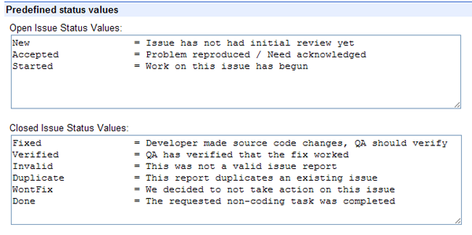
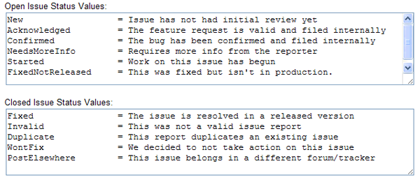
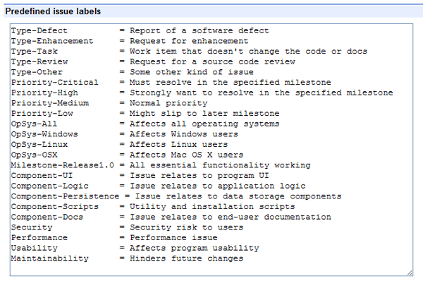
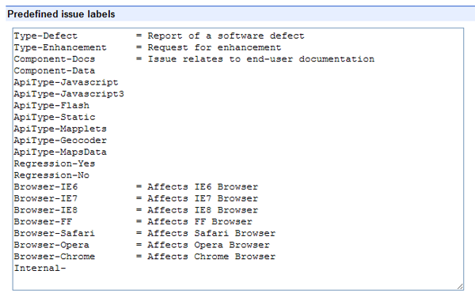
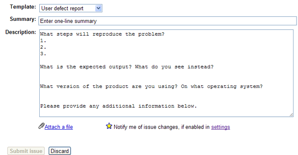
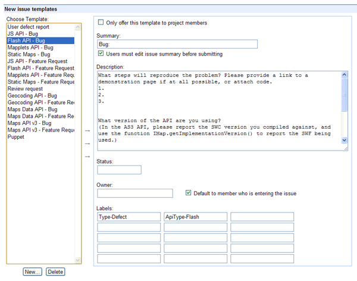
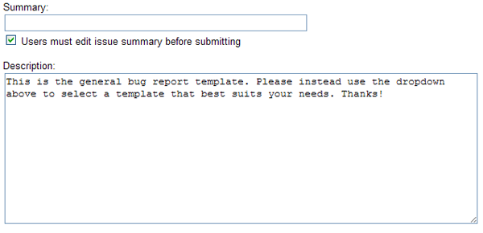
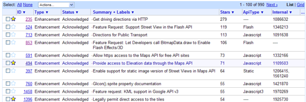
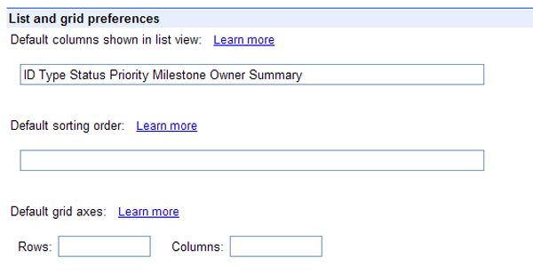
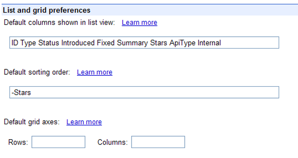
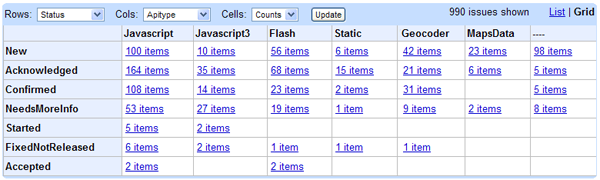
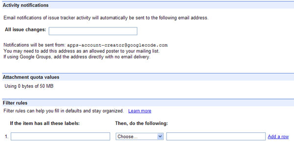
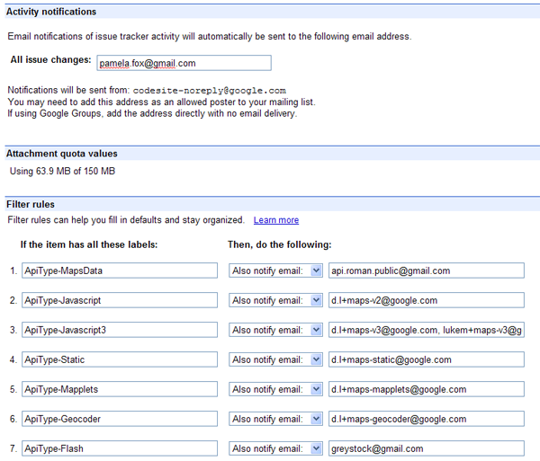
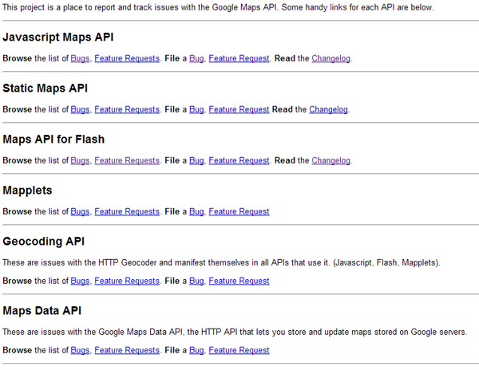
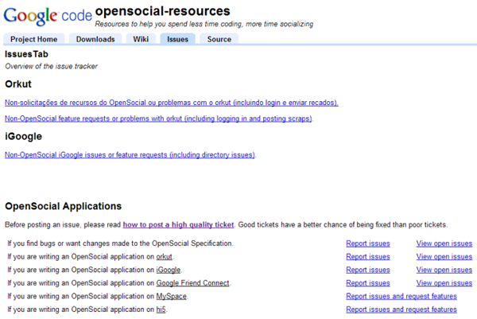

