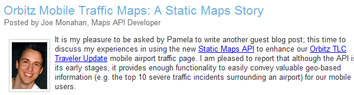

Top Developers
##############
이것은 최고의 개발자들에게 모두 중요한 것으로, 
당신의 머리에서 그것들의 목록을 연설하는 것과(또는 아마도 기계시스템으로부터) 
또한 그들과 1대 1 컨택을 하고 편안한 느낌으로 아는 사람이나 친구들에게 연락을 한다.

일단 최고의 개발자가 누군지 알아야 한고, 당신은 그들을 이용해 더 좋은 api와 더 좋은 커뮤니티를 만들 수 있다.
그들에게 미래의 api에 대한 조언을 구할 수도 있고(아마도 정식으로,신뢰할 수 있는 테스트 포럼에서), 
당신은 가끔 그들이 만들고 커뮤니티에 돌려줄 수 있는 유용한 샘플 코드를 제안할 수도 있다. 

그러나, 그 모든것을 하기 전에 당신은 먼저 알아내야 한다. 
:ref:`who they are <finding-them>`,
:ref:`reach out to them <contacting-them>`, and
:ref:`reward them <rewarding-them>`.

.. _finding-them:
 

Developer Types
***************
최고의 개발자들은 여러 가지 타입이 있고, 다른 장소에서 그들을 찾을 수 있다. 

The Forum Posters
=================
가장 눈에 띄는 최고의 개발자들은 (적어도 포럼에서 지원하는 대부분의 시간을 보내는 누군가) 또한 포럼에서 포스터가 상단에 있는 사람들이다. 
그들은 일반적으로 웹사이트 호스팅 샘플코드를 가지고 있으며, 포럼에서 포인터로 본인의 코드를 가리키며 질문에 답한다
그들은 훌륭한 개발자일 뿐만 아니라, 신출내기 질문자에게 답변을 아주 잘 공식화해 이치에 맞고 사실적으로 가르친다 
(대신 그들에게 답변을 작성하는 것보다)
그들은 당신의 일을 위해 고용하는 사람들로  만일 지원 군대 고용을 위해 머릿수를 세어본 적이 없다면

이러한 최고의 개발자를 찾으려면, 포럼에서 어떤 이의 포스터가 상단에 있는지 둘러보고, 그들의 답변의 질을 평가해보라.
대부분의 포럼에서 누구의 포스터가 가장 상단에 있는지 아는 방법은 간단하다. 
구글 그룹에서, 당신은 "이 그룹 정보"를 클릭하면 언제든 탑포스터를 확인할 수 있고 또한 매 달의 탑포스터를 알 수 있다. 
그 달의 탑포스터는 최근에 누가 가장 활동적이었는지 알 수 있는데에 유용하다. 
그리고 그들을 양성하기 위해, 시대를 초월한 탑 포스터들은 유용하다. 
또한 자주 게시되지는 않지만 이러한 개발자들이 찾기 위해 노력하고, 그들이 한다면, 
그것은 어떤 누구도 이해할 수 있으며 그들은 명쾌한 답을 드릴 것이다.
계획에 따라서 찾고 정렬하는 것은 쉽지 않다 - 실제로 포럼의 게시물을 볼 필요가 있고, 
당신이 봤을 때 드문 포스터에 기인하는 매우 유용한 게시물에 주의를 기울어야 한다. 

The Article Writers
===================
일부 개발자는 또한 기술적인 글쓰기에 대한 스킬을 갖는 축복을 얻었다.
그들이 사랑하는 기술적 주제를 취할 수 있고, 모두에게 호소할 수 있는 기술의 기본을
설명하거나(그리고 아마도 설명서의 일부보다 더 나을 수 있다) 
특히 그들 자신의 일에 있어서는 고급 주제를 설명할 수도 있다. 

문서 작성자는 좋은 포럼 포스터를 만들 가능성이 클 뿐만 아니라, 
그들이 종종 짧은 대답 대신에 큰 조각으로 자신의 단어를 유입 경로로 선택하는 것으로 보인다.
(하지만 크로스오버 할 수 있는 문서 작성자를 얻을 수 있다면 해라!)

기사 작성자를 찾기 위해, 당신은 그들이 작성했던 기사를 찾아야 한다. 
나는 우리 api에 대한 대부분의 기사를 Google Alerts 와 트위터 검색 api를 통해 찾는다.
그러나 그들 중 일부분은 간원을 통해 찾기도 한다. 
설명서에 있는 기사 섹션에서 우리는 또한 외부에서 작성된 문서에 대한 링크를 걸고,
하단에 있는, 우리는 콘텐츠를 제출하기 위한 링크(스프레드시트 양식)를 제공한다. 
이론적으로 이 링크는 기사 작성을 고려하는 글쓰기 능력을 갖춘 개발자들을 격려할 수 있다 

The Book Writers
================
문서 작성자는 때로는 완전히 작가로 변할 때가 있다. 
나는 이 세상에 있는 도서 작가들에게 거대한 존경을 표한다. 
책이 긴것보다, 그리고 종이에 프린트 된 것보다 나는 기술적 주제에 관해 집필하는 것에 전혀 자신감이 없었다
왜냐하면 내가 책 집필을 끝내는 순간 구식이 되어버릴 거라는 두려움때문에.
그러나 그들은 이러한 두려움 없이, 좋은 책을 집필하는것에 대해 나는 감사해하고있다.
심지어 책이 기술적으로 같은 주제로 표지가 덮여있더라도, 완전히 다른 각도에서 접근할 것이며,
이것은 책을 더 가치있게 만들 것이다.   

예를 들어, 'Sterling Udell', 은 Goolgle Mapplets 포럼의 탐 포스터중의 하나로, 
'KML in Maps Mashups and Mapplets'의 사용에 관래 쓰여졌다.
그의 책은 상당히 틈개 시장의 기술을 주제로 하고있지만, 
그는 웹 프로그래밍 기술이 없는 것는 것을 가정으로 한 시각에서 접근을 하였고, 훨씬 더
재미있게 만들었다.
그는 자바스크립트 객체를 비교하는 것처럼 큰 analogies를 만들었다 
"바탕 화면의 폴더" - 그리고 그것은 심플한 analogies를 위한 것이다. 
내가 결국 추천한 not-as-technical 마케팅 팀 구서원들에게 이 책을 읽을 것을 권유하게 되었다. 

그리고 내가 자바스크립트를 프로그래머가 아닌 사람들에게 가를칠 때 그의 anologies를 재사용했다.
당신의 청중이 언제나 필수 기술(자바스크립트, 파이썬, 기타 등등)의 전문가라고 가정해서는 안된다. 
때때로 그들은 비-프로그래머가 되어,  당신의 api의 가능성에 솔깃해 개의치않고 사용하는 것을 결정해야 한다. 
따라서, 그것은 유용한 자원을 가지고 이러한 각도에서 귀하의 api를 가르칠 수 있다 그 책 처럼. 

대부분의 작가들은 실제 api 팀에 제출하기 전 그들의 책을 리뷰하고자 기술적으로 접촉하길 원할 것이다, 
그리고 이것은 대부분의 도서 주제에 관해 알아내는 방법이다.  

Open Source Contributors
========================
일부 개발자들은 그냥 망할 코드를 작성하고,
그들의 마음을 축복하면서 오픈 소스도 마찬가지로 잘 되기를 바란다. 
이들 개발자들은 github, 소스포지 또는 googlecode.com의 독립 실행형 프로젝트에서 그들 코드의 주인이 되는데,
그것들을 찾는데 어려워 질 수 있다 - 당신과 api 개발자 모두 유용한 코드를 검색하는 것이.
모두에게 쉬워질 수 있도록, 관련된 오픈 소스 라이브러리 디렉토리를 만들거나 
그들 중 대다수를 위한 하나의 오픈 소스 프로젝트를 만드는 것을 제안한다. 

각각의 구글 지도 api에 대해, 우리는 구글 코드 프로젝트에서 '유틸리티 라이브러리'를 관리한다. 
외관상으로는, 그것은 하나의 프로젝트지만 사실, 그것은 같은 프로젝트에 호스팅 되어 있는 여러 라이브러리의 컬렉션이며,
코딩 및 문서 스탈일의 일관성있는 집합에 부합하는 것이다. 
오픈 소스 개발자들이 그들의 제안을 중심이 되는 라이브러리에 모두 기여할 수 있도록 유도하며, 
나는 그들의 자취를 유지하는 아주 쉬운 방법을 알고 있고, 리뷰를 통해 그들의 공헌을 더 잘 알게 되었다. 

개발자들의 이 프로젝트에 참가하도록 유도하기 위해, 
우리는 메인 프로젝트 페이지에 합류하고, 모든 블로그 포스트에 새로운 라이브러리 릴리즈를
발표하는 눈에 띠는 링크를 제공한다.
물론, 그들 스스로 가서 하는 개발자들도 더러 있다. 
왜냐하면 그들은 몇가지 환경설정을 가지고 있는데 자신의 개인 호스팅 솔루션(아마도 라이센스 이슈 때문일것이다) 이거나
알려지지 않은 기존의 오픈 소스 유틸리티 라이브러리 이거나. 
내가 미지의 세계에서 관련된 오픈 소스 프로젝트를 발견했을 때, 그들이 함께하기를 원한다면 저자에게 문의 할 것이다.
가끔은 그들이 원할 수도 있고, 아닐 수도 있겠지만 . 하지만 그것이 접촉을 하는데 방해를 주진 않을 것이다. 

jQuery는 '서드-파티 플러그인'에 대한 디렉토리 접근 방식을 취하고 있다
개발자는 중앙 갤러리로 그들의 플러그인에 대한 정보를 제출하게 하고,
점, 필터 및 검색과 같은 갤러리 엑스트라를 제공하도록 한다. 
이러한 접근 방법은 좀 더 확장성이 있고, jQuery는 세계에서 가장 인기있는 자바스트립트
프레임워크 만큼, 확장 가능한 접근방식을 가지고 그들에게 혜택을 제공한다. 
이것은 또한 오픈 소스 개발자들과의 1대 1 컨택의 기회가 줄어드는 것을 의미하지만
jQUary 개발자들은 메일링 리스트나 기타 수단을 통해 서로 알 수 있다. 

Paid Employees
==============
정규직의 일부로 실제, 매일 매일 귀하의 api를 사용하기 위해 돈을 지불하는 사람들이 있다. 
때때로 당신은 위의 경로를 통해 이러한 개발자들을 발견하게된다. 
그러나 유료 직원들이 포스팅되는 것 포럼(그들은 종종 그들이 작업하는 것에 관련한 정보를 누설하는 것에 대해 지각하고 있다)에, 
또는 오픈 소스에 기여하는 것은 흔치 않다는 것을 알아냈다. (종종 너무 많은 법적 장애물들이 있다)

지도 api에서, 자신의 회사를 위해 더 많은 할당량을 요청하는 이메일을 나에게 보낼 때, 나는 "유료 직원"의 대부분을 만났다.
아시다시피, 우리의 api는 geocoder의 http 요청의 수의 할당량을 배치하고, 큰 사이트는 종종 더 많은 할당량을 요구한다. 
만일 그들이 엔터프라이즈 api 고객이라면, 자동적으로 더 많은 할당량을 얻을 수 있고 그렇지 않으면 할당량을 요청해야 한다.

이러한 요청 이메일이 가장 유용한(그리고 무작위의) 연결 형성에 기여했다.  
그리고 또한 주목을 받고있는 훌륭한 매핑 웹사이트들을 누구보다 먼 저 알 수 있도록 도왔다. 
email-pamela는 일반적으로 인정하듯이 더 많은 할당량을 요청하는 오히려 원시적인 시스템으로,
미래에는 더 자동적인 무엇인가로 대체 될 가능성이 높다. 
그러나 그것은 나라면 만들지 않았을 개발자 회의를 위한 훌륭한 시스템이다 

그것이 당신의 api를 통해 가능한 경우, api를 사용하는게 괴로운/사용못하게하지 않을 것이고, 
무언가에 제한을 둘 수 있고, 제한을 해제하기 위해 당신의 연락을 요구하는 진지한 개발자도 있을 것이다. 
당신은 몇 쓰레기같은 요청을 받을 수 있지만, 좋은 것들을 얻을 수도 있을 것이다. 

앞에서 언급했듯이, 구글 지도 api는 또한 엔터프라이즈 맛을 제공하고,
다른 용어에 대해 지불하려는 기업, sla. 그리고 여러 가지 다른 이유. 
우리는 가끔 엔터 프라이즈 api 사용자와 교육 또는 컨설팅 회의를 개최하며,나도 개발자들을 그러한 방법으로 만나고 싶다. 
당신이 공식적으로 그렇게 개발자들을 만날 때, 좋은(친근하고, 캐쥬얼한)관계를 형성하기는 조금 어려울 것이다. 
나는 종종 그들와 함께 한잔 할 구실을 마련했고, 셔츠를 입은 남자가 악수하는 그러한 좀 더 평범한 관계를  만들어 나갈 수 있다. 
귀하의 API를 사용하기 위해 사람들이 돈을 지불할 때, 그들은 잠시 동안 머무를 가능성이 있어, 
그래서, 서로에게 좋은(잘)조건이 될 수 있도록 도와준다. 

Outreach
*********
자, 이제 당신은 api 개발자의 전 범위에 걸쳐 , 어디에서 최고의 개발자들을 찾아야 하는지 알 것이다. 
이제, 당신은 그들을 알고 가야한다. 

당신이 최고의 개발자를 포럼이나 웹 주위를 배회하면서 찾는 경우, 당신은 소개 이메일로 그들을 겨냥해야 한다.  
그 이메일은 본인 소개와(명확하지 않더라도), 그들의 커뮤니티 기여에 아낌없이 감사해야하거나 또는 그들이 만들어 낸 위대한 작품에 대해 인식하고,    
그 때 아마도 그들에게 어떻게 당신의 api를 사용하게 된건지 물어볼것이다.  본 방법에 대해 아마 묻게 될 것이다.  
목적은 어떤 대화가 오고가는지 알고, 바라건대 몇 번의 이메일 교류 이내에 당신은 친구가 될 수 있을 것이다.  

당신이 실제로 그들과 같은 도시에서 자신을 발견하고, 시간과 의지를 가지고 있다면  
그들을 당신의 동료에게 소개해줄 수 있는 사무실에 초대해 차를 마시거나 식사를 할 수 있다.
당신은 또한 외부에서 개발자 그룹들을 초대해, 그들을 만날 수 있고, 그들끼리 서로 만날 수 있다.  
(경쟁자를 초대하는 것에 주의만 하면 된다 - 우리가 한번은 네트워킹 점심에서 그들을 발견했을 때, 최고의 두 부동산지도 api 사이트간의 대결을 했었다)

Tokens of Appreciation
**********************
또한 귀하의 연락이메일에 감사를 표하기 위해, 
감사의 마음을 이상적으로 좀 더 확실하게 표현하는 것이 좋다. 당신이 개발자에게 보상할 수 있는 몇 가지 방법이 있다. 

Schwag
======
무료 물건!! 하지만 더욱 중요한 것은 당신의 브랜드 이름이나 로고가 있는 무료 물건은, 그들이 어디에서도 얻을 수 없는 물건이어야 한다. 

구글 개발자 관계 그룹에서, 예외의 경우를 대비해 우리는 구글 schwag를 비축해둔다 -
구글 로고가 박힌 머그컵, 물 병 및 스트레스 완화 장치를. 
우리는 또한 좀 더 많은 개발자 - 독특한 schwag을 가지고 있다. : 우리 개발자 웹사이트를 나타내는 QR코드가 박힌 티셔츠와,
안드로이드 인형, "API GURU"가 박힌 후드셔츠, 그리고 내가 좋아하는, 시 구절과 같이 우리 API를 사용한 마크네틱 포트리. 
이 물건들은 그들이 다른곳에서 얻을 수 없고,  그들은 자신의 못난 구글 자기 사랑을 자랑하도록 내버려두기 위한 물건이다.   

당신이 schwag 아이템 중 하나를 비축하기 위해 선택한다면, 티셔츠로 해라. 
모두가 프리 티셔츠를 사랑한다. (음. 오직 폴로 티셔츠만 입는 사람은 제외한다)
더해서, 마케팅의 관점에서 티셔츠는 당신의 브랜드를 위한 대단한 무료 홍보 수단이다. 
당신이 티셔츠를 위한 예산이 아주 없다면, 스티커나 펜과 같이 저렴한 아이템들을 비축해두어라.  

당신이 개발자에게 이메일을 보낼 때, 작은 감사의 표시로 그들에게 몇 가지 무료 schwag을 제공하는 것을 설명하고, 
그들의 티셔츠 사이즈와 주소를 물어봐라. 그 다음 schwag의 캐어 패키지에 짧은 감사 손편지를 넣어라.
그것은 모든 임신과 복잡한 육아 없이, 여름 캠프에서 아이의 엄마로 살아가는 환상에서 벗어날 수 있게 도와주는 좋은 방법이다. 

Guest Blog
==========
만일 당신의 api가 블로그가 있다면(그렇겠지만), 당신은 최고의 개발자들의 작품을 강조하기 위해 블로그를 사용할 수 있고,
그들에게 그들의 포트폴리오나 회사 등을 보여줄 수 있는 장소를 마련해주기도 한다. 
중요한 점은 블로그 포스트가 단순히 광고의 장이 되도록 내버려 두지 않는 것이다. 
이것은 기본적으로 다른 개발자들이 배울 수 있는 기술적 통찰력(또는 더 좋은 코드)을 제공해야 한다.
고도의 기술적인 방문자의 블로그 포스트는 유망한 시작을 나타내는 좋은 방법이다.

지도 api에서, 우리는 최고의 개발자로부터(그리고 몇몇 상당히 큰 회사)좋은 방문자 블로그를 포스트한다. 
`Travellr`_, `Orbitz`_, `LonelyPlanet`_, and `ArcGIS`_. 와 같은.. 

|orbitzblog|
지도 api 오픈 소스 라이브러리에, 위키 프로세스를 공개하는 것은 실제 릴리즈 단계 중 하나로서 
블로그 포스트를 작성하는 것을 포함하고, 그들이 수행하는 '포스팅 가이드라인'을 제공한다. 
우리는 그들이 포스트를 약력과 사진으로 시작할 수 있도록 유도하며, 이것은 우리가 규모가 크고 익명의 api 개발자 커뮤니티와 대면할 수 있도록 도와준다. 
예를 들어, 시작하는 개발자로부터 `Marker Tracker launch post` 등을 확인해보라. 

|markertrackerblog|
올바르게 일이 처리되면, 방문자 블로그 포스트도 윈윈해야 된다. :
개발자는 사이트의 트래픽 증가나 프리랜서 개발을 위한 요청이 증가하면서 이득을 얻을 수 있고, 
api 팀은 유용한 블로그 포스트를 하면서 이득을 얻을 수 있다.

.. _Travellr: http://googlegeodevelopers.blogspot.com/2009/06/travellr-behind-scenes-of-our-region.html
.. _Orbitz: http://googlemapsapi.blogspot.com/2008/03/orbitz-mobile-traffic-maps-static-maps.html
.. _LonelyPlanet: http://googlegeodevelopers.blogspot.com/2008/07/using-static-maps-and-http-geocoding-to.html
.. _ArcGIS: http://googlegeodevelopers.blogspot.com/2008/08/using-google-maps-to-visualize-arcgis.html
.. _posting guidelines: http://code.google.com/p/gmaps-utility-library-dev/wiki/BlogPostGuidelines
.. _Marker Tracker launch post: http://googlemapsapi.blogspot.com/2008/03/markertracker-10-which-way-did-he-go.html

.. |markertrackerblog| image:: ./screenshot_markertrackerblog.png

Trusted Testers
===============
신뢰할 수 있는 테스터 프로그램은 기본적으로 제한된 NDA'd 의 개발자들과 
새로운 기능(또는 전체 새로운 API)을 공유하는 방법이다. 
이 개발자 집합은 대부분 최고의 개발자가 될 것이며, 아마 어떤 개발자들은 당신의 상품을 사용하기 위해 돈을 지불할 것이고, 
무엇이 다가오고 있는지 알려고 할 것이다. 그래야 그들이 연간계획을 세울 수 있기 때문에.  

희망적인 것은 신뢰할 수 있는 테스터 프로그램에서 최고의 개발자는
피드백을 줄 수 있고(버그나 특징들..), 데모를 할 수 있으며, 기사 작성, 코드 익스텐션까지 가능하다. 
기본적으로, 희망은 그들이 보통  당신의 api와 함께 모든것을 할 수 있지만 그들은 새로운 기능을 사용할 것이다 . 
게다가 개발자가 활동적인 포럼 기부자라면,그들은 메일 포럼에서 일찍이 알려진 바 있는 새로운 사실에 관련한 질문에 답할 수 있는 메인 개발자가 되어야 한다 
만일 당신이 api나 이미 구축된 커뮤니티를 지원하는 새로운 기능을 내놓을 수 있다면, 
당신 스스로 엄청난 호의를 받을 수 있다. - 나를 믿어라, 이 포럼 지원 커뮤니티를 구축하는 데 수 개월, 수년이 걸릴 수 있다. 

api 팀의 이점은 여기에 분명히 있다 - 기능이 나오기 전에 우리는 피드백을 얻을 수 있고,
우리가 하위 호환성을 유지하는 것에 관해 걱정하지 않고 조정할 수 있다. 
어떻게 그것을 사용하는지 보여줌으로서, 무료로 동행 자원을 얻을 수 있다 
개발자에게 주어지는 혜택은 자신이 관심있어하는 api에 달려있다. 
그들이 프리랜서 개발자라면 그들이 직업을 얻을때까지 지원해주고
(자신의 이력서에 그들이 신뢰할 수 있는 테스터라고 기입할 수 있다)
만일 그들이 회사에서 일한다면, 그들의 노력을 능률화하는데 도움을 줄 수 있다. 
(어쩌면 몇 달 동안 기다려야 특징이 나올지도)

우리가 지도 api v3를 제작했을때 신뢰할만한 첫번째 테스트 프로그램을 가질 수 있었다. 
api에 대한 중요한 피드백을 받지 못했지만 , 개발자들은 빠르게 데모 및 확장 기능을 만들 수 있다. 
우리가 런칭했을 때, 갤러리에 x라는 외부 데모를 가지고 있었고, 
우리는 회의에서 그리고 블로그 포스트를 시작할 때 그것들을 보여줄 수 있었다. 
Gabriel Svennerberg 라는 개발자는 심지어 몇 기사를 작성하고 지도 api를 사용하여
책을 제작하고 있었다. 
그를 신뢰할만한 테스터 프로그램 제작에 초대하는 것이 중요할 것이라 생각했고,
마침 그가 책의 주제로 계획하고 있던 시기와 맞아떨어졌다. 

지도 api v3의 신뢰할 수 있는 테스터 프로그램이 성공적인 이래로, 우리는
플래쉬 api를 3차원 관점에서 보는 것을 테스트하기 위해 제작을 결정했다. 
플래쉬 api 개발자 설립 단체가 있는지도 몰랐던 나로서는, 누가 이 프로그램에 초대되는 것인지 아는것만으로도 흥미로웠다. 
플래쉬 api는 겨우 일년이 지났지만, 나는 실제 구축된 바 없는 플래쉬 api 커뮤니티를 인정하기가 슬프다. 

그래서 나는 최근에 모든 플래쉬 오픈 소스 라이브러리 작성자들의 활동적인 포럼 포스터들 중 몇을 초대했다. 
몇몇 개발자들은 api 관련해 블로그 포스트를 작성했고, 몇 일본 개발자들은 죽일만큼 굉장한 데모(그 나라의 청주에는 뭔가가 있는 듯 하다)를 마친 상태다.
우리가 플래쉬 api를 3차원 시각에서 작업중이라 미리 발표한 후로, 나는 이것을 행사에서도 말하고 흥미로운 개발자들을 찾는 방법으로 삼고 있다. 
예전에 나는 3차원 플래쉬 관점에서 일할 때 해킹한적이 있다고 트윗한적이 있다. 그리고 답글을 통해 몇 개발자를 발견할 수 있었다. 
이 개발자 집단은 api를 이용한 대단한 데모를 제작했고, 더 중요한것은 api를 이용해 우리가 전혀 생각하지
못했던 것을 만들 수 있고 새로운 기능에 대해서 더 흥분을 느낄 수 있다. 
나는 지도 api v3 그룹에서보다 이 그룹에서 더 많은 피드백을 받을 수 있다고 말한 적이 있으며,
이렇게 지적하는 이유는 우리가 단순히 기존의 api를 재작성하게 하는 것보다 그들에게 무언가 완전히 새로운 놀이감을 제공하기 때문이다. 
당신이 신뢰할만한 개발자에게 무언가 다른 놀이거리를 준다면, 그들이 그것을 가지고 더 열심히 노력하고 리포팅 하는것을 보게 될 수 있을 것이라 생각한다. 
(신뢰할 수 있는 테스터 섹션을 참고하라)

Linking
=======
때로는 개발자의 작업을 칭송하기 위해 할 수 있는 모든 것을 할 필요가 있는데, 적절한 장소에서 링크를 거는 것이다. 
지도 api에 관해, 데모 갤러리에 있는 데모에 링크(쉽게 소스 코드 샘플을 보고 배울 수 있다)걸기, 기사 섹션에 기사 링크를 걸어놓았다. 
웹사이트는 매우 쿨하게 api를 사용하고있지만 데모를 할 만큼 충분히 심플하지는 않고,
우리의 api 방문 페이지를 표시하는 추천 프로젝트 피드를 포함할 수 있고, 
또한 공식적인 api 계정에서 이것을 트윗할 수 있고, 우리 팔로워들이 그것들을 즐기고 심지어 리트윗 하기를 희망한다.
어떻게 바이러스에 걸릴 지 모르기 때문에, 관련된 모든것을 트윗해라. 
일단 무언가에 링크를 걸었거나 트윗을 했거나 둘 다를 했을 때, 개발자가 그것에 대해 알려고 할 것이다. 
그들은 리소르를 공유해준 당신에게 감사할 것이며, 또한 새로운 트래픽이 어디레서부터 오는지 이해할 수 있을 것이다. 
